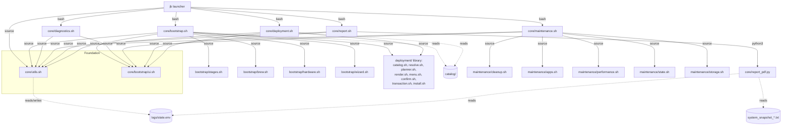

# Architecture

JB Toolkit is a modular Bash application for macOS maintenance and deployment,
structured as a **menu-driven launcher that executes five independent module scripts
as child processes**. Modules share code by sourcing a common utility layer and share
runtime data through a file-based state system.

## Top-level layout

```
jb-ToolKit/
├── jb                      # Interactive launcher (entry point)
├── README.md               # User-facing documentation (Spanish)
├── docs/                   # Engineering documentation (this directory)
├── catalog/                # Deployment data: applications/bundles/profiles (+ reserved vendors/)
│                           #   The ONLY place software is defined (INSTALL_METHOD model)
├── logs/                   # Runtime artifacts: state.env, session logs, snapshots, PDFs
└── core/
    ├── utils.sh            # Foundation layer — sourced by every module
    ├── bootstrap.sh        # Module 1: base tools + onboarding wizard
    ├── diagnostics.sh      # Module 2: system scan + health score
    ├── maintenance.sh      # Module 3: cleanup + optimization
    ├── report.sh           # Module 4: executive report + PDF
    ├── report_pdf.py       # PDF generator (Python / reportlab)
    ├── deployment.sh       # Module 5: workstation deployment (launcher option 4)
    ├── deployment/         # Deployment LIBRARY (see docs/Deployment-Architecture.md)
    │   │                   #   Sourced by deployment.sh AND bootstrap.sh — one
    │   │                   #   catalog, one planner, one installer
    │   ├── catalog.sh      # Catalog access, hierarchy queries, V1–V10 validator
    │   ├── doctor.sh       # Advisory maintainability diagnostics
    │   ├── resolve.sh      # Bundles → apps with provenance, compatibility filter
    │   ├── planner.sh      # Deployment Plan builder + export (PLAN_* contract)
    │   ├── render.sh       # Presentation: summary/explain/tree/confirmation/result
    │   ├── menu.sh         # Catalog-generated navigation, bundle review, hardware
    │   │                   #   recommendations, Custom, JB Picks browser
    │   ├── confirm.sh      # Confirmation loop; [I] executes the plan
    │   ├── transaction.sh  # Installation Transaction (execution record)
    │   └── install.sh      # Plan executor: pre-flight + per-app engine + verification
    ├── bootstrap/          # Bootstrap sub-modules
    │   ├── ui.sh           # Shared UI primitives (used by ALL modules)
    │   ├── stages.sh       # Numbered stage progress ([1/5], elapsed time)
    │   ├── brew.sh         # Homebrew install / validate / base tools / updates
    │   ├── hardware.sh     # Hardware profile display, Rosetta detection
    │   └── wizard.sh       # Onboarding wizard: one question → Deployment pipeline
    └── maintenance/        # Maintenance sub-modules
        ├── cleanup.sh      # Cache / log / Trash / Homebrew cleanup
        ├── storage.sh      # Large-file scan, cloud sync, LaunchAgents
        ├── apps.sh         # App risk scoring and user-driven removal
        ├── performance.sh  # Performance profiles (light / aggressive / restore)
        └── state.sh        # Maintenance state lifecycle + executive summary
```

## Subsystems

| Subsystem | Location | Responsibility |
|---|---|---|
| **Launcher** | `jb` | Menu loop; runs modules via `bash <script>`; owns the session |
| **Foundation** | `core/utils.sh` | Config, colors, state I/O, session logging, `run_cmd`, health score, Homebrew access + query cache, size helpers, `parse_selection`, hardware primitives |
| **UI layer** | `core/bootstrap/ui.sh` | `print_section`, `success`/`warn`/`info`/`error_msg` (all also write to the session log), banner, completion footer, `ask_yes_no`, elapsed time |
| **Bootstrap** | `core/bootstrap.sh` + `core/bootstrap/*` | CLT check, Homebrew install, base tools (fastfetch, verified), pending-update offer, hardware summary, onboarding wizard that hands off to the Deployment library |
| **Diagnostics** | `core/diagnostics.sh` | System summary, top processes, health score, state write |
| **Maintenance** | `core/maintenance.sh` + `core/maintenance/*` | Preview-confirm-clean workflow, storage analysis, app cleanup, performance profiles, post-score |
| **Reporting** | `core/report.sh`, `core/report_pdf.py` | Terminal executive report; optional PDF built from `state.env` + system snapshot |
| **Deployment** | `core/deployment.sh` + `core/deployment/*` | Catalog-driven menus, bundle review, hardware recommendations, Deployment Planner, plan review, pre-flight validation, per-application execution and verification, Installation Transaction record (see [Deployment-Architecture.md](Deployment-Architecture.md)). The `core/deployment/*` files are a **library** also consumed by Bootstrap's wizard |
| **State** | `logs/state.env` | Key-value persistence across module processes and sessions |

## Module dependency graph



Key property: **there are no dependencies between module orchestrators.** No module
runs, sources, or reads the internals of another module's *orchestrator*. They
communicate exclusively through `logs/state.env` and the shared session log.

Two subsystems are **shared function libraries**, not module internals, and may be
sourced by any orchestrator (the `ui.sh` precedent, extended in v2.0.1):

- `core/bootstrap/ui.sh` — the UI layer for all modules.
- `core/deployment/*.sh` — the Deployment library (catalog, resolver, planner,
  renderer, menus, confirmation, transaction, installer). Sourced by
  `deployment.sh` and by `bootstrap.sh`, so the toolkit has exactly one catalog,
  one planner, and one installer.

## Process model

The launcher runs each module with `bash "$script"` — a **child process**, not a
`source`. Consequences:

- Module-level globals (e.g., `APP_METADATA_CACHE`, the Homebrew query cache) live and
  die with one module run. Nothing leaks between modules.
- Data that must survive a module run goes through `logs/state.env`
  (see [State-System.md](State-System.md)).
- The session identity (`JB_SESSION_LOG`, `JB_SYSTEM_SNAPSHOT`) is `export`ed by the
  launcher's `init_session`, so child modules inherit it via the environment. Each
  module also calls `init_session` defensively; it is a no-op when the variables are
  already set, which makes modules runnable standalone (a fallback session is created).

## Layering rules (as implemented)

1. `utils.sh` depends on nothing else in the project. Everything depends on it.
2. `ui.sh` depends only on `utils.sh` (colors, `session_write`). Despite living under
   `bootstrap/`, it is the UI layer for **all** modules.
3. Sub-modules (`bootstrap/*`, `maintenance/*`, `deployment/*`) are function
   libraries: they define functions and module-level variables but perform no work
   at source time beyond cheap initialization (e.g., an `uname -m` check).
4. The `deployment/*` library is additionally shared: both `deployment.sh` and
   `bootstrap.sh` source it. It is the only place software selection, planning,
   and installation exist.
5. Orchestrator scripts (`bootstrap.sh`, `maintenance.sh`, `diagnostics.sh`,
   `report.sh`, `deployment.sh`) own control flow, ordering, and exit codes.

## Error-handling strategy

- Entry points enable strict-ish modes (`set -Eeuo pipefail` in `jb`, `bootstrap.sh`,
  `report.sh`; `maintenance.sh` omits `-e` and `diagnostics.sh` omits `-u` —
  see [Future-Roadmap.md](Future-Roadmap.md), Potential Future Improvements).
- Non-critical failures are absorbed with `|| true` or `|| warn "..."` so a cosmetic
  failure never aborts a maintenance run.
- Critical failures (no internet, no Homebrew, base tools not installable) abort the
  module with `print_completion "false"` and a non-zero exit.
- `install_session_traps` (launcher only) wires `ERR` and `EXIT` traps that record the
  failing command, line, and exit code to the session log.
