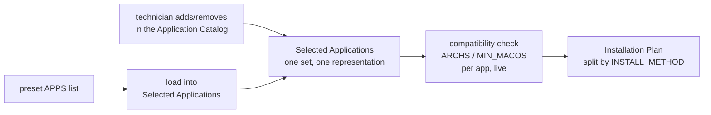

# Catalog Format — Data Contracts

This is the **normative specification** for everything under `catalog/`. The
loaders implement exactly these rules; the validator rejects exactly these
violations. If this document and a loader ever disagree, this document wins and
the loader is the bug.

Design context lives in [Deployment-Design.md](Deployment-Design.md). This file is
the contract.

## Common file conventions

Every catalog file is a plain-text, shell-friendly flat file in the `state.env`
tradition:

- `KEY=value`, one pair per line. The **first** `=` splits key from value; values
  may contain `=`.
- Values are raw text — no quoting, no escaping, no line continuations. One line per
  value.
- Lines starting with `#` are comments. Blank lines are ignored.
- Keys are `UPPER_SNAKE_CASE`. Unknown keys are ignored by tools (forward
  compatibility) but discouraged.
- Encoding is UTF-8. User-visible values (`NAME`, `DESCRIPTION`, `JB_PICK_NOTE`) are
  **Spanish**, like all UI text.
- **No YAML, no JSON, no SQLite — ever.** A technician with any text editor is a
  first-class catalog author. Parsing must stay implementable with the same awk
  pattern as `state_value`.

IDs (application, preset) are kebab-case: lowercase letters, digits, and
hyphens (`^[a-z0-9][a-z0-9-]*$`).

## The two layers

As of v2.2, the catalog has exactly two data layers — **Applications** and
**Presets** — not four. There is no intermediate "bundle" grouping and no
profile/category menu-placement layer; see
[architecture/0006-deployment-flattening.md](architecture/0006-deployment-flattening.md)
for why those were removed rather than kept as "historical implementation
detail." A preset is nothing more than a named list of application IDs, and an
application's `CATEGORY` field (not a preset field) drives how the catalog
browser groups applications for presentation.

As of v2.2.1, every application owns **exactly one** `CATEGORY` (not a set of
tags) and every preset lives as one `[id]` section inside a single
`catalog/presets.conf` file (not one file per preset). Both changes exist
purely to remove duplication and drift — see
[architecture/0007-catalog-consistency.md](architecture/0007-catalog-consistency.md).

As of v2.3.0, the catalog carries **rich metadata** — homepage, license,
architecture, and more — for every application, and the philosophy behind
that expansion is written down on its own:
[CATALOG_CONSTITUTION.md](CATALOG_CONSTITUTION.md) (the long-term
principles) and [CATALOG_STANDARD.md](CATALOG_STANDARD.md) (the exact
schema). This document stays the normative parsing/validation reference;
those two are the *why* and the *what*, respectively.

## Layer 1 — Applications

**Location:** `catalog/applications/<id>/app.conf`

**The directory is the application.** Each application owns a directory named by its
ID; `app.conf` is the only required file. The directory may later gain assets
(README.md, icons, screenshots, localized descriptions, release notes, compatibility
notes) without any format change. Tools must resolve applications by **directory
name** and read `<dir>/app.conf` — never glob for conf files across the tree.

### Fields

Full field-by-field contract lives in
[CATALOG_STANDARD.md](CATALOG_STANDARD.md); summarized here for the parser's
sake:

| Field | Required | Contract |
|---|---|---|
| `APP_ID` | yes | Must equal the directory name exactly (renamed from `ID` in v2.3.0) |
| `NAME` | yes | The application's official name, shown verbatim in the UI |
| `CATEGORY` | yes | Exactly one lowercase tag, one of `ai`, `browsers`, `cloud`, `communication`, `creative`, `development`, `device-management`, `media`, `networking`, `printers-scanners`, `productivity`, `security`, `system` (the validator rejects anything else — see V6). **Live, consumed data**: drives which single section of the Application Catalog browser the app appears in. Purely presentational — no Deployment logic branches on a category name, and changing an app's `CATEGORY` never changes installation behavior |
| `DESCRIPTION` | yes | One line, Spanish |
| `HOMEPAGE` | yes (v2.3.0) | The application's official homepage URL — metadata only, no consumer in Deployment today |
| `LICENSE` | yes (v2.3.0) | Free text: an SPDX identifier where a specific license applies, else `Free`/`Freemium`/`Proprietary`/`Open Source` — see CATALOG_STANDARD.md |
| `INSTALL_METHOD` | yes | `brew` \| `cask` \| `mas` \| `pkg` \| `dmg` \| `manual`. See "Installation methods" below |
| `PACKAGE_NAME` | iff method is `brew`/`cask`/`mas` | The package identifier: Homebrew formula name, cask token, or Mac App Store numeric ID (renamed from `PACKAGE` in v2.3.0) |
| `PACKAGE_TYPE` | yes (v2.3.0) | `formula` \| `cask` \| `app-store` \| `installer` \| `manual` — must agree with `INSTALL_METHOD` (V10); metadata only, does not drive installer behavior |
| `ARCHITECTURE` | yes (v2.3.0) | `universal` \| `arm64` \| `intel` — a **descriptive** field for humans/future features. Not the compatibility filter — see `ARCHS` below |
| `DOWNLOAD_URL` | iff method is `manual`/`pkg`/`dmg` | Where the technician obtains the app. Optional for other methods |
| `JB_PICK` | no | `true` or absent. Any other value is invalid |
| `JB_PICK_NOTE` | required iff `JB_PICK=true` | The reasoning behind the recommendation, Spanish. **A pick without a non-empty note is invalid** |
| `ARCHS` | no | Space-separated `uname -m` values (`arm64`, `x86_64`). Absent = all architectures. **This**, not `ARCHITECTURE`, is what `app_incompatibility_reason` actually filters on |
| `MIN_MACOS` | no | Minimum macOS **major** version (integer, e.g. `12`). Absent = any supported macOS |
| `HW_RECOMMEND` | no | Space-separated machine families this app is recommended for: `macbook_air`, `macbook_pro`, `mac_mini`, `mac_studio`, `imac`, plus the pseudo-family `external_display`. Apps carrying this field are annotated (★) in the Application Catalog when the detected hardware matches — advisory only as of v2.4.0, never pre-checked — and are exempt from the doctor's "unreferenced" advisory |
| `ALTERNATIVES` | no (v2.3.0) | Free text: comparable tools. Never validated against the catalog — may legitimately name software this catalog doesn't carry |
| `RELATED` | no (v2.3.2) | Space-separated application IDs: companion tools typically used alongside this one (not substitutes — see `ALTERNATIVES`). Same shape as a preset's `APPS`; every ID must resolve to a real application (V12) |
| `NOTES` | no (v2.3.0) | Free text, Spanish: caveats that don't fit elsewhere |
| `WEBSITE` | no (v2.3.0) | A secondary link, only when meaningfully different from `HOMEPAGE` |
| `REQUIREMENTS` | no (v2.3.0) | Free text, Spanish: human-readable requirements `ARCHS`/`MIN_MACOS` can't express |

The `PACKAGE_NAME` line is the **single place in the repository** where a package
identifier may appear for deployment purposes (unique per method — the brew, cask,
and mas namespaces are independent). Presets must never contain package names. The
legacy v2.0.0 keys `BREW=`/`CASK=`, and the pre-v2.3.0 keys `ID=`/`PACKAGE=`, are
**invalid**; the validator rejects them so a leftover line can never become a
silent no-op.

**Removed in v2.2: `RECOMMENDED`.** It validated (`true`/absent) but had zero
consumers anywhere in the codebase — a second, weaker "this is good" flag
sitting beside `JB_PICK`, which already means "recommended" and additionally
requires a justification note. Dead, redundant fields don't survive a
simplification pass; use `JB_PICK` + `JB_PICK_NOTE` for anything that used to
carry `RECOMMENDED=true`.

### Installation methods

| Method | Automated? | Carrier field | `PACKAGE_TYPE` | Behavior |
|---|---|---|---|---|
| `brew` | yes | `PACKAGE_NAME` (formula) | `formula` | Installed by the engine (`brew install`) and verified per app |
| `cask` | yes | `PACKAGE_NAME` (cask token) | `cask` | Installed by the engine (`brew install --cask`) and verified per app |
| `mas` | not yet | `PACKAGE_NAME` (App Store ID) | `app-store` | Manual track: reported as "instalar desde App Store" |
| `pkg` | not yet | `DOWNLOAD_URL` | `installer` | Manual track: reported as a manual step, download page offered |
| `dmg` | not yet | `DOWNLOAD_URL` | `installer` | Manual track: reported as a manual step, download page offered |
| `manual` | no | `DOWNLOAD_URL` | `manual` | Manual track: reported as a manual step, download page offered |

Applications on the **manual track** are first-class catalog members: they appear
in presets, JB Picks, plans, and reports. They are **never** deployment
failures — the plan carries them separately (`PLAN_MANUAL`) and the result screen
lists them as pending manual steps. If a manual-track app's bundle
(`/Applications/<NAME>.app`) is already present, it is reported as already
installed (verified by existence).

### Example

```bash
# catalog/applications/keka/app.conf
APP_ID=keka
NAME=Keka
CATEGORY=system
DESCRIPTION=Compresor y descompresor moderno y sin publicidad
HOMEPAGE=https://www.keka.io/
LICENSE=GPL-3.0-only
INSTALL_METHOD=cask
PACKAGE_NAME=keka
PACKAGE_TYPE=cask
ARCHITECTURE=universal
JB_PICK=true
JB_PICK_NOTE=Reemplazo moderno de The Unarchiver. Años de uso sin incidencias en equipos de clientes.
```

```bash
# catalog/applications/pdfgear/app.conf — not available through Homebrew
APP_ID=pdfgear
NAME=PDFgear
CATEGORY=productivity
DESCRIPTION=Editor PDF gratuito y completo
HOMEPAGE=https://www.pdfgear.com/
LICENSE=Free
INSTALL_METHOD=manual
DOWNLOAD_URL=https://www.pdfgear.com/
PACKAGE_TYPE=manual
ARCHITECTURE=universal
JB_PICK=true
JB_PICK_NOTE=Cubre la mayoría de casos de edición PDF sin licencia de Acrobat. Ahorro real para clientes.
```

## Layer 2 — Presets

**Location:** `catalog/presets.conf` — a single file, one `[id]` section per
preset. As of v2.2.1 this replaced one file per preset
(`catalog/presets/<id>.preset`): same data, same fields, same flat
`KEY=value` convention inside each section, just one file to open, diff, and
scan instead of eight. See
[architecture/0007-catalog-consistency.md](architecture/0007-catalog-consistency.md)
for why, including why this stayed an awk-parseable flat file rather than
becoming YAML or JSON.

A preset is a named, predefined **selection** — nothing more. Choosing a preset
in Deployment populates the working "Selected Applications" set; the technician
reviews and can freely add, remove, or toggle any application before
installing. **A preset is a shortcut into the same selection every manual pick
also produces — there is no separate "preset execution path."**

### Section format

A section starts with `[id]` on its own line (same kebab-case rule as
application IDs) and runs until the next `[` line or end of file. Inside a
section, lines are the same flat `KEY=value` pairs as everywhere else in the
catalog — comments and blank lines are ignored, so blank lines between
sections are purely for readability and carry no meaning.

### Fields

| Field | Required | Contract |
|---|---|---|
| `NAME` | yes | Display name shown wherever a preset is listed — the wizard's onboarding question, the CLI's usage help, and plan/result screens |
| `DESCRIPTION` | yes | One line, Spanish |
| `ORDER` | no | Integer sort key in the flat preset list. Default `50`; ties break alphabetically |
| `APPS` | yes | Space-separated application IDs — **the entire preset**. No nested references, no groups, no installation logic |

A preset references **application IDs only** — never package names, never
another preset. There is deliberately no field for composing one preset out of
others; see the ADR for the reuse-vs-duplication trade-off this accepts.

### Example

```bash
# catalog/presets.conf (excerpt)
[developer]
NAME=Developer
DESCRIPTION=Estación de trabajo para desarrollo de software
ORDER=50
APPS=appcleaner keka rectangle stats pdfgear openlogi git visual-studio-code node pnpm docker codex antigravity
```

### Loading a preset

As of v2.4.1, presets are not reachable anywhere in the standalone
Deployment module's interactive UI — it opens straight into the Application
Catalog with an empty selection and has no command to load one. This
followed v2.4.0's earlier change (a preset-picker screen removed in favor of
an in-catalog `l` command) once real-world use showed technicians always
ended up hand-picking from the catalog regardless, making the loader itself
one more concept without enough payoff to justify — see
[architecture/0012-terminal-ui-refinement.md](architecture/0012-terminal-ui-refinement.md).
The `APPS`/`NAME`/`DESCRIPTION`/`ORDER` format above is completely
unaffected — presets remain fully real data, just not interactively loaded
from this one screen.

Two places still load a preset exactly as `load_preset_into_selection`
always worked: **Bootstrap's onboarding wizard**
(`core/bootstrap/wizard.sh`) shows its own flat preset list, including a
synthetic "Empezar vacío" entry, as its first-run "how will this Mac be
used?" question — a different screen for a different reason, deliberately
untouched by either v2.4.0 or v2.4.1. And the **CLI** — `deployment.sh
--resolve/--explain/--tree/--plan <preset>` — takes a preset name directly,
unaffected by any interactive-UI change.

`JB_PICK=true` applications are **not** a separate menu entry or screen. As
of v2.2.2, a pick is annotated inline (`⭐`) wherever it appears in the
Application Catalog — the same catalog flag, surfaced where selection
actually happens — and its `JB_PICK_NOTE` reasoning appears in the plan's
explain view alongside every other selected application. There used to be a
separate read-only "JB Picks" browser; it was removed because everything it
showed was already reachable through the normal catalog and plan screens.
Picks still aren't a `.preset` file, for the same reason as before: a static
list of IDs would be a second source of truth that could drift from the
`JB_PICK` flags themselves.

There is no category/subcategory nesting for presets. Growth is absorbed by the
flat list (8 presets today; the Application Catalog's category grouping is
where deeper organization happens, over *applications*, not presets — see
Layer 1's `CATEGORY`).

## Layer 3 — Vendors (RESERVED)

**Location:** `catalog/vendors/`

Reserved for future deployment presets-of-presets: named compositions for
specific organizations (JB Repair defaults, Business, Education, LCS,
individual clients). **Known tension, deliberately deferred, not solved**: a
future "vendor" that composes multiple presets is structurally the same shape
as the "bundle" concept this simplification just removed. If this layer is
ever built, design it consciously against that tension — don't silently
resurrect bundles under a new name. See the ADR.

**Nothing parses this directory today.** It contains only a README documenting
the intent. Do not place parseable data here and do not build against it until
the layer is designed for real.

## Resolution semantics



- Loading a preset populates Selected Applications with its `APPS` list,
  filtering out anything incompatible with this machine (`ARCHS`/`MIN_MACOS`
  vs. `uname -m`/`sw_vers -productVersion`) — the exclusion is recorded and
  shown, never silent.
- From that point forward, **preset-sourced and manually-added applications are
  indistinguishable in representation** — both are just members of Selected
  Applications, tagged only for *display* provenance (`preset:<id>` / `manual`).
  There is exactly one code path from "Selected Applications" to "Installation
  Plan," regardless of how each app got there. `HW_RECOMMEND` matches never add
  themselves to Selected Applications (v2.4.0) — they are advisory-only, shown
  as a ★ badge in the Application Catalog, so there is no third provenance
  value for them.
- The planner splits Selected Applications by `INSTALL_METHOD`: `brew`/`cask`
  records go to the automatic install list, everything else to the manual-step
  list.

## Validation rules (catalog validator)

An invalid catalog entry is a fatal load error that names the offending file. The
complete rule set:

| # | Rule |
|---|---|
| V1 | `APP_ID` equals its directory name (applications) / `[id]` section header is valid kebab-case (presets) — checked against **every** `[...]` header found in `presets.conf`, not just the well-formed ones, so a malformed header (stray capital, a space, a typo) is reported instead of silently invisible to every listing |
| V2 | All required fields present and non-empty (as of v2.3.0: `APP_ID`, `NAME`, `CATEGORY`, `DESCRIPTION`, `HOMEPAGE`, `LICENSE`, `INSTALL_METHOD`, `PACKAGE_TYPE`, `ARCHITECTURE`, plus `PACKAGE_NAME` where applicable) |
| V3 | `INSTALL_METHOD` present and ∈ {`brew`, `cask`, `mas`, `pkg`, `dmg`, `manual`}; `PACKAGE_NAME` present for `brew`/`cask`/`mas`; `DOWNLOAD_URL` present for `manual`/`pkg`/`dmg`; legacy `BREW`/`CASK` keys rejected; legacy pre-v2.3.0 `ID`/`PACKAGE` keys rejected |
| V4 | `JB_PICK` is `true` when present |
| V5 | `JB_PICK=true` requires a non-empty `JB_PICK_NOTE` |
| V6 | `ARCHS` values ∈ {`arm64`, `x86_64`}; `MIN_MACOS` and preset `ORDER` are integers; `HW_RECOMMEND` values ∈ the known machine families; `CATEGORY` ∈ the known category set; `ARCHITECTURE` ∈ {`universal`, `arm64`, `intel`} |
| V7 | Every preset's `APPS` entry resolves to an existing application directory |
| V8 | No duplicate application ID globally (enforced by directory structure) or preset `[id]` section within `presets.conf`; no duplicate application ID within one preset's `APPS`; no `method:PACKAGE_NAME` pair defined by more than one application |
| V9 | No duplicate `KEY=` line within one `app.conf` or one preset's `[id]` section — the parser silently keeps only the first occurrence, so a repeated key is otherwise an invisible catalog inconsistency |
| V10 | `PACKAGE_TYPE` agrees with `INSTALL_METHOD` (`brew`↔`formula`, `cask`↔`cask`, `mas`↔`app-store`, `pkg`/`dmg`↔`installer`, `manual`↔`manual`) — deliberately redundant metadata that must never drift apart, see CATALOG_STANDARD.md |
| V11 | No two applications share a `NAME` or a `HOMEPAGE` — the signature of the same real application accidentally catalogued twice under different IDs |
| V12 | Every `RELATED` entry resolves to an existing application (same check as preset V7, applied to this field) — `ALTERNATIVES` is deliberately exempt, see its field entry above |

## Catalog Doctor (advisory diagnostics)

`deployment.sh --doctor` runs the validator and then adds **maintainability
suggestions** on a valid catalog. Advisories never fail validation:

| # | Advisory |
|---|---|
| D1 | Application exists but no preset references it (apps with `HW_RECOMMEND` are exempt — they are reachable through the hardware-recommendation surfacing in the Application Catalog) |
| D2 | Applications referenced by many presets (default threshold: 4 or more) are reported together, by name, as a curation aid — flat presets mean editing one of these apps means touching every preset that lists it; this advisory exists so that fact is visible, not hidden |

Note: a JB Pick missing its note is **not** an advisory — it is validation failure
V5. A recommendation without reasoning is invalid, not merely improvable.

## Adding catalog entries — technician quick reference

**New application:** create `catalog/applications/<id>/`, write `app.conf` per
[CATALOG_STANDARD.md](CATALOG_STANDARD.md) — the required fields, its
`INSTALL_METHOD` (`PACKAGE_NAME` for brew/cask/mas, `DOWNLOAD_URL` for
manual/pkg/dmg), a matching `PACKAGE_TYPE`, plus `HOMEPAGE`, `LICENSE`, and
`ARCHITECTURE`. Verify the package identifier against the real installation
method — `brew info --formula <name>` or `brew info --cask <name>` — before
committing it. If the app isn't available through Homebrew, that is not a
problem: declare it `manual` with its download page. If it's a JB Pick, write the
reason — the note is what makes it a recommendation, and it should reflect real
operational experience, not just "this app is now in the catalog" (see
CATALOG_STANDARD.md's "What JB_PICK means here"). Set `CATEGORY` to exactly one
value from the known set — that's what places the app in the Application Catalog
browser. Resist adding a new category for one app; check whether an existing
category already fits before proposing a new one (see the ADR and
[CATALOG_CONSTITUTION.md](CATALOG_CONSTITUTION.md) §2–3).

**New preset:** add an `[id]` section to `catalog/presets.conf` with `NAME`,
`DESCRIPTION`, optionally `ORDER`, and `APPS` — every application ID the preset
should preselect. **Menus regenerate from the data — no code changes, ever.**
Before adding an app to several presets, check `deployment.sh --doctor`'s D2
advisory: if it's about to become a "referenced by many presets" app, that's
fine, just know that changing it later means editing every preset that lists it.
