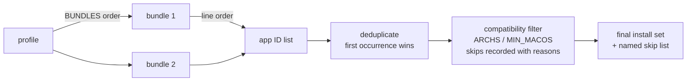

# Catalog Format — Data Contracts

This is the **normative specification** for everything under `catalog/`. The Phase 3
loaders implement exactly these rules; the Phase 3 validator rejects exactly these
violations. If this document and a loader ever disagree, this document wins and the
loader is the bug.

Design context lives in [Deployment-Design.md](Deployment-Design.md). This file is
the contract.

## Common file conventions

Every catalog file is a plain-text, shell-friendly flat file in the `state.env`
tradition:

- `KEY=value`, one pair per line. The **first** `=` splits key from value; values
  may contain `=`.
- Values are raw text — no quoting, no escaping, no line continuations. One line per
  value.
- Lines starting with `#` are comments. Blank lines are ignored.
- Keys are `UPPER_SNAKE_CASE`. Unknown keys are ignored by tools (forward
  compatibility) but discouraged.
- Encoding is UTF-8. User-visible values (`NAME`, `DESCRIPTION`, `JB_PICK_NOTE`) are
  **Spanish**, like all UI text.
- **No YAML, no JSON, no SQLite — ever.** A technician with any text editor is a
  first-class catalog author. Parsing must stay implementable with the same awk
  pattern as `state_value`.

IDs (application, bundle, profile) are kebab-case: lowercase letters, digits, and
hyphens (`^[a-z0-9][a-z0-9-]*$`).

## Layer 1 — Applications

**Location:** `catalog/applications/<id>/app.conf`

**The directory is the application.** Each application owns a directory named by its
ID; `app.conf` is the only required file. The directory may later gain assets
(README.md, icons, screenshots, localized descriptions, release notes, compatibility
notes) without any format change. Tools must resolve applications by **directory
name** and read `<dir>/app.conf` — never glob for conf files across the tree.

### Fields

| Field | Required | Contract |
|---|---|---|
| `ID` | yes | Must equal the directory name exactly |
| `NAME` | yes | Display name, shown verbatim in the UI |
| `BREW` | exactly one of `BREW`/`CASK` | Homebrew formula name |
| `CASK` | exactly one of `BREW`/`CASK` | Homebrew cask name |
| `DESCRIPTION` | yes | One line, Spanish |
| `CATEGORIES` | no | Space-separated lowercase tags (informational; used for grouping in future flows) |
| `JB_PICK` | no | `true` or absent. Any other value is invalid |
| `JB_PICK_NOTE` | required iff `JB_PICK=true` | The reasoning behind the recommendation, Spanish. **A pick without a non-empty note is invalid** |
| `ARCHS` | no | Space-separated `uname -m` values (`arm64`, `x86_64`). Absent = all architectures |
| `MIN_MACOS` | no | Minimum macOS **major** version (integer, e.g. `12`). Absent = any supported macOS |
| `RECOMMENDED` | no | `true` or absent. Ordering hint in future Custom flows |

The `BREW`/`CASK` line is the **single place in the repository** where a Homebrew
package name may appear for deployment purposes. Bundles and profiles must never
contain package names.

### Example

```bash
# catalog/applications/keka/app.conf
ID=keka
NAME=Keka
CASK=keka
DESCRIPTION=Compresor y descompresor moderno y sin publicidad
CATEGORIES=utilities
JB_PICK=true
JB_PICK_NOTE=Reemplazo moderno de The Unarchiver. Años de uso sin incidencias en equipos de clientes.
RECOMMENDED=true
```

## Layer 2 — Bundles

**Location:** `catalog/bundles/<id>.bundle`

A bundle is an ordered list of **application IDs**, one per line. `#` comments and
blank lines are ignored. The **first comment line is the bundle's display name**
(contract, not convention — the loader reads it).

Bundles carry no other metadata. They never contain package names, versions, or
application fields — those live on the application record.

```bash
# JB Essentials
appcleaner
keka
rectangle
stats
pdfgear
openlogi
```

Rules:

- Every line must be an existing application directory ID. A dangling reference is a
  validation failure that names the bundle file and the missing ID.
- Duplicate IDs within one bundle are invalid.
- The same application may appear in **multiple bundles** — deduplication happens at
  resolution time.

## Layer 3 — Profiles

**Location:** `catalog/profiles/<id>.profile`

A profile composes bundles and places itself in the Deployment menu tree.

### Fields

| Field | Required | Contract |
|---|---|---|
| `NAME` | yes | Display name (confirmation and result screens) |
| `DESCRIPTION` | yes | One line, Spanish |
| `CATEGORY` | yes | Top-level menu placement (display text, e.g. `Professional`) |
| `SUBCATEGORY` | no | Second-level menu label. Absent = the profile is its category's direct leaf |
| `ORDER` | no | Integer sort key within its menu level. Default `50`; ties break alphabetically |
| `BUNDLES` | yes | Space-separated bundle IDs, resolution order preserved |

Profiles reference **bundle IDs only** — never application IDs, never package names.

### Menu-generation contract

1. Level 1 lists distinct `CATEGORY` values ordered by the minimum `ORDER` among
   their profiles, plus the fixed `Custom` and `JB Picks` entries.
2. A category containing exactly one profile with no `SUBCATEGORY` collapses: it is
   selected directly from level 1.
3. A category with multiple profiles opens a submenu listing them by `SUBCATEGORY`
   (fallback `NAME`), ordered by `ORDER`.
4. Maximum depth is two levels. Growth is absorbed by adding categories, keeping
   every menu at ~7 visible entries.

### Example

```bash
# catalog/profiles/engineering.profile
NAME=Engineering
DESCRIPTION=Perfil profesional para ingeniería y desarrollo técnico
CATEGORY=Professional
SUBCATEGORY=Engineering
ORDER=30
BUNDLES=jb-essentials productivity developer
```

## Layer 4 — Vendors (RESERVED)

**Location:** `catalog/vendors/`

Reserved for future deployment presets: named compositions of **profiles** for
specific organizations (JB Repair defaults, Business, Education, LCS, individual
clients). One level above profiles, same referential philosophy — vendors will
compose profiles without modifying them.

**Nothing parses this directory today.** It contains only a README documenting the
intent. Do not place parseable data here and do not build against it until the layer
is designed for real.

## Resolution semantics



- Resolution order: bundles in `BUNDLES` order, applications in bundle line order,
  first occurrence wins on duplicates.
- Compatibility filtering compares `ARCHS` against `uname -m` and `MIN_MACOS`
  against `sw_vers -productVersion` (major). Every filtered application is recorded
  as a named skip with its reason — **silent skips are a contract violation.**

## Validation rules (Phase 3 validator)

An invalid catalog entry is a fatal load error that names the offending file. The
complete rule set:

| # | Rule |
|---|---|
| V1 | `ID` equals its directory name (applications) / filename stem (bundles, profiles) |
| V2 | All required fields present and non-empty |
| V3 | Exactly one of `BREW` / `CASK` per application |
| V4 | `JB_PICK`, `RECOMMENDED` are `true` when present |
| V5 | `JB_PICK=true` requires a non-empty `JB_PICK_NOTE` |
| V6 | `ARCHS` values ∈ {`arm64`, `x86_64`}; `MIN_MACOS` and `ORDER` are integers |
| V7 | Every bundle line resolves to an existing application directory |
| V8 | No duplicate IDs within a bundle; no duplicate application/bundle/profile IDs globally |
| V9 | Every `BUNDLES` entry resolves to an existing bundle file |
| V10 | Bundle files begin with a display-name comment line |

## Adding catalog entries — technician quick reference

**New application:** create `catalog/applications/<id>/`, write `app.conf` with the
required fields, exactly one of `BREW`/`CASK`. If it's a JB Pick, write the reason —
the note is what makes it a recommendation.

**New bundle:** create `catalog/bundles/<id>.bundle`, first line `# Display Name`,
then one existing application ID per line.

**New profile / menu entry:** create `catalog/profiles/<id>.profile` with
`CATEGORY` (and `SUBCATEGORY` to nest), `ORDER` to position it, `BUNDLES` to compose
it. **Menus regenerate from the data — no code changes, ever.**
