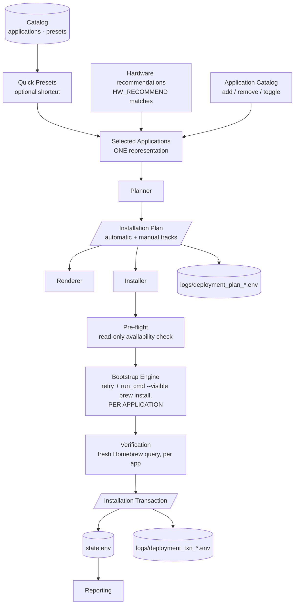

# Deployment Architecture

The complete pipeline reference for the Deployment module. Where
[Deployment-Design.md](Deployment-Design.md) records the design decisions and their
history, this document describes the **final architecture** — the layers, their
contracts, and where future functionality belongs. See
[architecture/0006-deployment-flattening.md](architecture/0006-deployment-flattening.md)
for *why* it looks like this rather than the Profiles→Bundles→Applications
hierarchy of earlier versions.

## The pipeline

The pipeline has two consumers: the **Deployment module** (launcher option 4) and
**Bootstrap's onboarding wizard** (launcher option 1), which sources the same
sub-module libraries and asks one question — how will this Mac be used? — before
handing off to the exact same `start_deployment_flow` function the Deployment
menu's preset picker calls. There is one catalog, one selection model, one
planner, and one installer in the toolkit; Bootstrap owns no software selection
of its own.

**Everything is one workflow around one concept: Selected Applications.**
Whether an application enters that set via a Quick Preset, a hardware
recommendation, or a manual toggle in the Application Catalog, it is
indistinguishable in representation from that point on — there is exactly one
code path from selection to plan (`build_plan_from_selection`), never a
preset-specific or bundle-specific execution branch.

## Layer responsibilities

| Layer | File | Responsibility | Explicitly NOT its job |
|---|---|---|---|
| **Catalog** | `catalog/` + `core/deployment/catalog.sh` | Data and access: applications (the only place package names exist), presets, `CATEGORY`-based browsing queries (one app, one category), hard validation (V1–V9) | Deciding what to install |
| **Doctor** | `core/deployment/doctor.sh` | Advisory maintainability diagnostics on a valid catalog | Failing validation — advisories never block |
| **Selection** | `core/deployment/selection.sh` | **The one selection model.** `SELECTED_APPS`: add/remove/toggle, preset loading, hardware-recommendation folding, and per-app compatibility checking (`app_incompatibility_reason`, moved here from the former resolver — this is exactly "can this app join the selection") | Presentation, planning, persistence |
| **Planner** | `core/deployment/planner.sh` | **The only decision-making layer past selection.** Classifies `SELECTED_APPS` into automatic/manual tracks by `INSTALL_METHOD`, counts JB Picks, freezes a plan. Does not resolve presets, does not know what a category is | Executing anything, deciding what's selected |
| **Renderer** | `core/deployment/render.sh` | Pure presentation of catalog/plan/transaction data: preset summaries, explain, the preset-vs-selection diff view, confirmation, result | Resolving, deciding, mutating |
| **Menus** | `core/deployment/menu.sh` + `confirm.sh` | The Quick Presets picker; the Application Catalog (the one screen selection actually happens in — add/remove/toggle without leaving it); the confirmation gate. Menus only **collect** technician decisions — the planner applies them | Hardcoded names, planning logic, filtering anything itself |
| **Installer** | `core/deployment/install.sh` | Executes an already-built plan: partition installed/pending (Homebrew query for automatic apps, `/Applications` existence for manual ones), read-only pre-flight against Homebrew's index, invoke the engine per application, verify per app, offer manual download pages | **Decisions of any kind** — no resolution, no compatibility rules, no catalog reads |
| **Engine** | Bootstrap's proven pattern (`retry 3 5` + `run_cmd --visible brew install [--cask]`), applied **per application** | The only installation machinery in the toolkit. One failed or unavailable application never prevents the rest from installing | Being duplicated |
| **Transaction** | `core/deployment/transaction.sh` | The execution record: what actually happened, verified counts, named outcomes, timing, cancellation | Making decisions, estimating |
| **Reporting** | `core/report.sh` (+ future consumers) | Displays verified execution data from `state.env` | Re-measuring or reconstructing events |

## The two contracts

### Installation Plan (Planner → everything downstream)

Built by `build_plan_from_selection [preset_id]` — consumes `SELECTED_APPS` as
already-final; there are no `excluded`/`bundles` parameters because the
selection already **is** the input, not something the planner re-derives.
Serialized by `export_deployment_plan` to `logs/deployment_plan_<id>.env`.

The plan carries two tracks:

- `PLAN_APPS` — `id|name|provenance|method|package` (method `brew`/`cask`): the
  automatic install list, in selection order, with display provenance
  (`preset:<id>`, `hardware`, or `manual`).
- `PLAN_MANUAL` — `id|name|provenance|method|download-url` (method `mas`/`pkg`/`dmg`/
  `manual`): first-class plan members the toolkit cannot automate. Reported as
  manual steps at every stage; **never failures**.

`PLAN_SKIPPED` (`id|name|reason`) is narrower than in earlier versions: it holds
**only** applications a loaded preset wanted that are incompatible with this
Mac. A technician simply not selecting an application is not a "skip" — it
never enters `SELECTED_APPS` in the first place, so there is nothing to
record. The accountability this could seem to lose is recovered differently:
`--tree` renders a diff between the loaded preset and the final selection
(kept / added / removed), computed at render time, not stored.

The critical property: **plan records carry package specs**, so the installer
executes the plan verbatim and never opens the catalog. If a future field is
needed downstream, it is added to the plan — never fetched around it.

Every CLI command is a different representation of this same plan:

| Command | Representation |
|---|---|
| `--resolve <preset>` | Concise summary — what would happen |
| `--explain <preset>` | Full provenance — where every app came from, why every compatibility exclusion |
| `--tree <preset>` | Preset-vs-selection diff (CLI usage always has zero manual edits, so this is a no-op diff — meaningful when the same plan was built interactively) |
| `--plan <preset>` | Serialized contract (also written to `logs/`) |

### Installation Transaction (Installer → Reporting/History)

Created by `txn_begin`, closed by `txn_finish`, persisted by `txn_export` to
`logs/deployment_txn_<id>.env` and pointed to from `state.env`
(`LAST_DEPLOYMENT_TRANSACTION`). Records session id, preset (`TXN_PRESET`,
`"custom"` if none), plan id and file, start/end/duration,
attempted/installed/already/skipped/manual/failed counts, named installed /
already-installed / manual apps, named failures **with their reasons**
(`id|name|reason` — e.g. "no disponible en Homebrew" vs "no quedó instalada
tras la instalación"), cancellation status, and the final result
(`success | partial | failed | cancelled`). Manual steps never degrade the
result: a deployment whose only pending items are manual installs is a success.

The transaction is **the** consumption point for future Reports, Support Bundles,
and History — events are never reconstructed from logs when the record exists.

## Truthfulness enforcement points

- Compatibility exclusions are decided live, in `selection.sh`, the moment an
  application would enter `SELECTED_APPS` — shown inline in the Application
  Catalog (⛔ + reason, never assigned a selection number) rather than
  deferred to a post-hoc skip report.
- **Pre-flight before mutation:** every pending package is verified against
  Homebrew's index (`brew info`, read-only) before anything installs. An
  unavailable package becomes a named failure with its reason and a continue/abort
  gate — it never aborts the other applications and never surprises mid-install.
- The installer's counts come from **post-execution verification** against a fresh
  Homebrew query (`brew_cache_reset` → per-app check), never from `brew install`'s
  exit code alone.
- Manual-track apps are reported as manual steps, explicitly not failures; if the
  app bundle already exists in `/Applications`, it is reported as already
  installed (verified by existence, not assumption).
- A transient `brew list` failure cannot poison a session: the query cache only
  marks itself loaded on success (utils.sh), and verification always resets it.
- Cancellation is a recorded outcome, not a silent return — at the confirmation
  gate **and** at the pre-flight continue gate.

## Where future functionality belongs

| Future need | Where it goes | Why |
|---|---|---|
| Automating `mas` / `pkg` / `dmg` installs | A new engine branch in `install.sh` keyed on the plan's `method` field | The catalog and plan already carry the method; only the execution branch is missing |
| Deployment history browsing | `core/deployment/history.sh` reading `logs/deployment_txn_*.env` | Transactions are the execution record |
| Vendor presets | `catalog/vendors/` (reserved) | Known, deliberately unresolved tension: a vendor composing presets is structurally a bundle again — see ADR-0006 |
| Estimated download sizes | A plan field populated by the planner | The plan is the single source of truth for "what would happen" |
| New compatibility rules | `app_incompatibility_reason` in `selection.sh` | The only place selection-eligibility decisions exist |
| A different UI (GUI, web, remote) | Consume the Planner + plan export as-is | Rendering is already separated; the planner needs no modification |
| New catalog advisories | `doctor.sh` | Advisory-only by contract |
| Per-app post-install steps | A plan field + an installer execution step | Installer executes plan records; it never decides |

## Invariants (violations are design regressions)

1. Data drives behavior; the Application Catalog's grouping is generated from
   each application's single `CATEGORY`, the Quick Presets list from
   `catalog/presets.conf`.
2. Applications and presets are each defined exactly once — every application
   owns exactly one category, every preset is exactly one `[id]` section.
   There is no intermediate grouping layer to keep in sync with either.
3. A preset is a flat list of application IDs — no nested references, no
   installation logic, no nested composition.
4. **`SELECTED_APPS` is the one selection model.** Preset-sourced,
   hardware-recommended, and manually-added applications are
   indistinguishable in representation past `selection.sh`; provenance is
   display-only.
5. The Planner is the only decision-making layer past selection. The
   Application Catalog and the hardware-recommendation fold-in collect and
   propose; they never filter what the planner sees.
6. The Installer only executes; the engine (retry + `run_cmd --visible` +
   verification, per application) is the only installer, and Bootstrap consumes
   it through the same library instead of owning machinery of its own.
7. Reports consume verified execution data (the transaction), never estimates.
8. Every layer has one file and one responsibility.
9. Nothing is skipped silently; every compatibility exclusion is named and
   recorded, and every plan-vs-selection change is visible via `--tree`.
10. One application's failure or unavailability never aborts the rest of a
    deployment.
11. A manual installation requirement is an honest outcome, never a failure.
