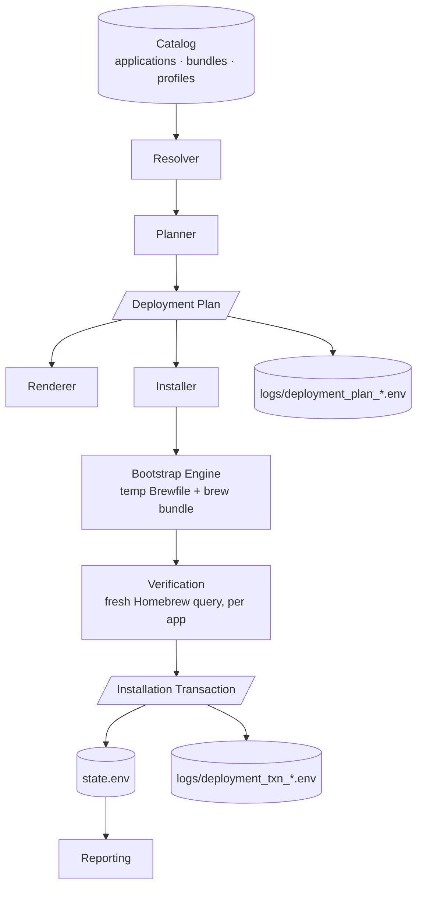

# Deployment Architecture

The complete pipeline reference for the Deployment module. Where
[Deployment-Design.md](Deployment-Design.md) records the design decisions and their
history, this document describes the **final architecture** — the layers, their
contracts, and where future functionality belongs.

## The pipeline

## Layer responsibilities

| Layer | File | Responsibility | Explicitly NOT its job |
|---|---|---|---|
| **Catalog** | `catalog/` + `core/deployment/catalog.sh` | Data and access: applications (the only place package names exist), bundles, profiles, hierarchy queries, hard validation (V1–V10) | Deciding what to install |
| **Doctor** | `core/deployment/doctor.sh` | Advisory maintainability diagnostics on a valid catalog | Failing validation — advisories never block |
| **Resolver** | `core/deployment/resolve.sh` | Bundles → app IDs with provenance; compatibility filtering with reasons | Presentation, persistence |
| **Planner** | `core/deployment/planner.sh` | **The only decision-making layer.** Profile, bundles, application order, filtering, skips + reasons, JB Picks, provenance, package specs — all decided here. Also serializes the plan (`export_deployment_plan`) | Executing anything |
| **Renderer** | `core/deployment/render.sh` | Pure presentation of catalog/plan/transaction data: menu elements, summary, explain, tree, confirmation, result | Resolving, deciding, mutating |
| **Menus** | `core/deployment/menu.sh` + `confirm.sh` | Navigation generated from catalog data; the confirmation gate | Hardcoded names, planning logic |
| **Installer** | `core/deployment/install.sh` | Executes an already-built plan: partition installed/pending, compile temp Brewfile from plan records, invoke the engine, verify per app | **Decisions of any kind** — no resolution, no compatibility rules, no catalog reads |
| **Engine** | Bootstrap's proven pattern (`retry` + `run_cmd --visible brew bundle`) | The only installation machinery in the toolkit | Being duplicated |
| **Transaction** | `core/deployment/transaction.sh` | The execution record: what actually happened, verified counts, named outcomes, timing, cancellation | Making decisions, estimating |
| **Reporting** | `core/report.sh` (+ future consumers) | Displays verified execution data from `state.env` | Re-measuring or reconstructing events |

## The two contracts

### Deployment Plan (Planner → everything downstream)

Built by `build_deployment_plan <profile>` / `build_custom_plan <bundles>`;
serialized by `export_deployment_plan` to `logs/deployment_plan_<id>.env`.

The critical property: **plan records carry package specs**
(`id|name|source-bundle|pkg-type|pkg-name`), so the installer executes the plan
verbatim and never opens the catalog. If a future field is needed downstream, it is
added to the plan — never fetched around it.

Every CLI command is a different representation of this same plan:

| Command | Representation |
|---|---|
| `--resolve <perfil>` | Concise summary — what would happen |
| `--explain <perfil>` | Full provenance — where every app came from, why every skip |
| `--tree <perfil>` | Catalog structure with dedup/skip annotations |
| `--plan <perfil>` | Serialized contract (also written to `logs/`) |

### Installation Transaction (Installer → Reporting/History)

Created by `txn_begin`, closed by `txn_finish`, persisted by `txn_export` to
`logs/deployment_txn_<id>.env` and pointed to from `state.env`
(`LAST_DEPLOYMENT_TRANSACTION`). Records session id, profile, plan id and file,
start/end/duration, attempted/installed/already/skipped/failed counts, named
installed and failed apps, cancellation status, and the final result
(`success | partial | failed | cancelled`).

The transaction is **the** consumption point for future Reports, Support Bundles,
and History — events are never reconstructed from logs when the record exists.

## Truthfulness enforcement points

- Compatibility skips are decided in the resolver, carried in the plan, and shown
  at confirmation **and** in the result — with reasons, at every stage.
- The installer's counts come from **post-execution verification** against a fresh
  Homebrew query (`brew_cache_reset` → per-app check), never from `brew bundle`'s
  exit code alone.
- A transient `brew list` failure cannot poison a session: the query cache only
  marks itself loaded on success (utils.sh), and verification always resets it.
- Cancellation is a recorded outcome, not a silent return.

## Where future functionality belongs

| Future need | Where it goes | Why |
|---|---|---|
| Deployment history browsing | `core/deployment/history.sh` reading `logs/deployment_txn_*.env` | Transactions are the execution record |
| Vendor presets | `catalog/vendors/` (reserved) + a resolver extension | Vendors compose profiles, same referential pattern one level up |
| Estimated download sizes | A plan field populated by the planner | The plan is the single source of truth for "what would happen" |
| New compatibility rules | `app_incompatibility_reason` in the resolver | The only place skip decisions exist |
| A different UI (GUI, web, remote) | Consume the Planner + plan export as-is | Rendering is already separated; the planner needs no modification |
| New catalog advisories | `doctor.sh` | Advisory-only by contract |
| Per-app post-install steps | A plan field + an installer execution step | Installer executes plan records; it never decides |

## Invariants (violations are design regressions)

1. Data drives behavior; menus are generated from the catalog.
2. Applications, bundles, and profiles are each defined exactly once.
3. Profiles compose bundles; bundles compose applications; nothing skips a level.
4. The Planner is the only decision-making layer.
5. The Installer only executes; the Bootstrap engine is the only installer.
6. Reports consume verified execution data (the transaction), never estimates.
7. Every layer has one file and one responsibility.
8. Nothing is skipped silently; every outcome is named and recorded.
