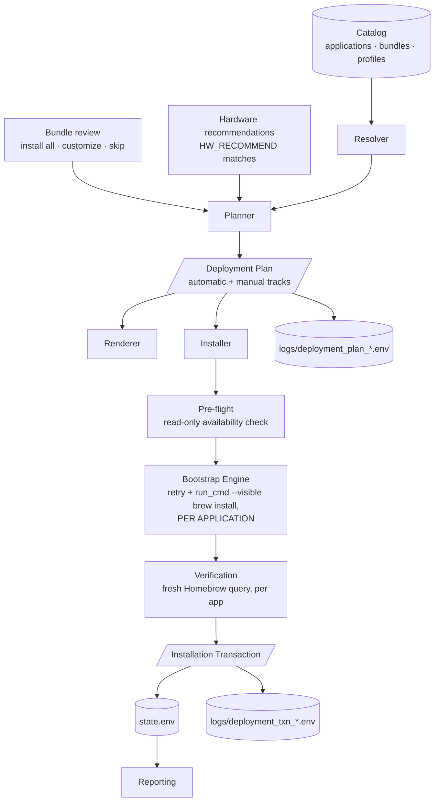

# Deployment Architecture

The complete pipeline reference for the Deployment module. Where
[Deployment-Design.md](Deployment-Design.md) records the design decisions and their
history, this document describes the **final architecture** — the layers, their
contracts, and where future functionality belongs.

## The pipeline

The pipeline has two consumers: the **Deployment module** (launcher option 4) and
**Bootstrap's onboarding wizard** (launcher option 1), which sources the same
sub-module libraries and asks one question — how will this Mac be used? — before
handing off to the planner. There is one catalog, one planner, and one installer
in the toolkit; Bootstrap owns no software selection of its own.

## Layer responsibilities

| Layer | File | Responsibility | Explicitly NOT its job |
|---|---|---|---|
| **Catalog** | `catalog/` + `core/deployment/catalog.sh` | Data and access: applications (the only place package names exist), bundles, profiles, hierarchy queries, hard validation (V1–V10) | Deciding what to install |
| **Doctor** | `core/deployment/doctor.sh` | Advisory maintainability diagnostics on a valid catalog | Failing validation — advisories never block |
| **Resolver** | `core/deployment/resolve.sh` | Bundles → app IDs with provenance; compatibility filtering with reasons | Presentation, persistence |
| **Planner** | `core/deployment/planner.sh` | **The only decision-making layer.** Profile, bundles, application order, filtering, skips + reasons (compatibility AND technician deselections), the automatic/manual split by `INSTALL_METHOD`, JB Picks, provenance, hardware extras, package specs — all decided here. Also serializes the plan (`export_deployment_plan`) | Executing anything |
| **Renderer** | `core/deployment/render.sh` | Pure presentation of catalog/plan/transaction data: menu elements, summary, explain, tree, confirmation, result | Resolving, deciding, mutating |
| **Menus** | `core/deployment/menu.sh` + `confirm.sh` | Navigation generated from catalog data; the per-bundle review (install all / customize / skip); the hardware-recommendation offer; the confirmation gate. Menus only **collect** technician decisions — the planner applies them | Hardcoded names, planning logic, filtering anything itself |
| **Installer** | `core/deployment/install.sh` | Executes an already-built plan: partition installed/pending (Homebrew query for automatic apps, `/Applications` existence for manual ones), read-only pre-flight against Homebrew's index, invoke the engine per application, verify per app, offer manual download pages | **Decisions of any kind** — no resolution, no compatibility rules, no catalog reads |
| **Engine** | Bootstrap's proven pattern (`retry 3 5` + `run_cmd --visible brew install [--cask]`), applied **per application** | The only installation machinery in the toolkit. One failed or unavailable application never prevents the rest from installing | Being duplicated |
| **Transaction** | `core/deployment/transaction.sh` | The execution record: what actually happened, verified counts, named outcomes, timing, cancellation | Making decisions, estimating |
| **Reporting** | `core/report.sh` (+ future consumers) | Displays verified execution data from `state.env` | Re-measuring or reconstructing events |

## The two contracts

### Deployment Plan (Planner → everything downstream)

Built by `build_deployment_plan <profile> [excluded] [extras] [bundles]` /
`build_custom_plan <bundles> [excluded] [extras]` — the optional arguments carry
the technician's bundle-review decisions and accepted hardware recommendations;
serialized by `export_deployment_plan` to `logs/deployment_plan_<id>.env`.

The plan carries two tracks:

- `PLAN_APPS` — `id|name|source|method|package` (method `brew`/`cask`): the
  automatic install list, in install order with provenance (`source` is a bundle
  ID or the literal `hardware`).
- `PLAN_MANUAL` — `id|name|source|method|download-url` (method `mas`/`pkg`/`dmg`/
  `manual`): first-class plan members the toolkit cannot automate. Reported as
  manual steps at every stage; **never failures**.

The critical property: **plan records carry package specs**, so the installer
executes the plan verbatim and never opens the catalog. If a future field is
needed downstream, it is added to the plan — never fetched around it.

Every CLI command is a different representation of this same plan:

| Command | Representation |
|---|---|
| `--resolve <perfil>` | Concise summary — what would happen |
| `--explain <perfil>` | Full provenance — where every app came from, why every skip |
| `--tree <perfil>` | Catalog structure with dedup/skip annotations |
| `--plan <perfil>` | Serialized contract (also written to `logs/`) |

### Installation Transaction (Installer → Reporting/History)

Created by `txn_begin`, closed by `txn_finish`, persisted by `txn_export` to
`logs/deployment_txn_<id>.env` and pointed to from `state.env`
(`LAST_DEPLOYMENT_TRANSACTION`). Records session id, profile, plan id and file,
start/end/duration, attempted/installed/already/skipped/manual/failed counts,
named installed / already-installed / manual apps, named failures **with their
reasons** (`id|name|reason` — e.g. "no disponible en Homebrew" vs "no quedó
instalada tras la instalación"), cancellation status, and the final result
(`success | partial | failed | cancelled`). Manual steps never degrade the
result: a deployment whose only pending items are manual installs is a success.

The transaction is **the** consumption point for future Reports, Support Bundles,
and History — events are never reconstructed from logs when the record exists.

## Truthfulness enforcement points

- Compatibility skips are decided in the resolver, technician deselections in the
  bundle review — both carried in the plan and shown at confirmation **and** in
  the result, with reasons, at every stage.
- **Pre-flight before mutation:** every pending package is verified against
  Homebrew's index (`brew info`, read-only) before anything installs. An
  unavailable package becomes a named failure with its reason and a continue/abort
  gate — it never aborts the other applications and never surprises mid-install.
- The installer's counts come from **post-execution verification** against a fresh
  Homebrew query (`brew_cache_reset` → per-app check), never from `brew install`'s
  exit code alone.
- Manual-track apps are reported as manual steps, explicitly not failures; if the
  app bundle already exists in `/Applications`, it is reported as already
  installed (verified by existence, not assumption).
- A transient `brew list` failure cannot poison a session: the query cache only
  marks itself loaded on success (utils.sh), and verification always resets it.
- Cancellation is a recorded outcome, not a silent return — at the profile gate
  **and** at the pre-flight continue gate.

## Where future functionality belongs

| Future need | Where it goes | Why |
|---|---|---|
| Automating `mas` / `pkg` / `dmg` installs | A new engine branch in `install.sh` keyed on the plan's `method` field | The catalog and plan already carry the method; only the execution branch is missing |
| Deployment history browsing | `core/deployment/history.sh` reading `logs/deployment_txn_*.env` | Transactions are the execution record |
| Vendor presets | `catalog/vendors/` (reserved) + a resolver extension | Vendors compose profiles, same referential pattern one level up |
| Estimated download sizes | A plan field populated by the planner | The plan is the single source of truth for "what would happen" |
| New compatibility rules | `app_incompatibility_reason` in the resolver | The only place skip decisions exist |
| A different UI (GUI, web, remote) | Consume the Planner + plan export as-is | Rendering is already separated; the planner needs no modification |
| New catalog advisories | `doctor.sh` | Advisory-only by contract |
| Per-app post-install steps | A plan field + an installer execution step | Installer executes plan records; it never decides |

## Invariants (violations are design regressions)

1. Data drives behavior; menus are generated from the catalog.
2. Applications, bundles, and profiles are each defined exactly once.
3. Profiles compose bundles; bundles compose applications; nothing skips a level.
4. The Planner is the only decision-making layer. Interactive screens (bundle
   review, hardware recommendations) collect choices; they never filter.
5. The Installer only executes; the engine (retry + `run_cmd --visible` +
   verification, per application) is the only installer, and Bootstrap consumes
   it through the same library instead of owning machinery of its own.
6. Reports consume verified execution data (the transaction), never estimates.
7. Every layer has one file and one responsibility.
8. Nothing is skipped silently; every outcome is named and recorded.
9. One application's failure or unavailability never aborts the rest of a
   deployment.
10. A manual installation requirement is an honest outcome, never a failure.
