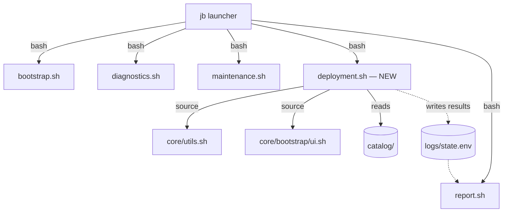
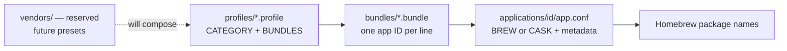
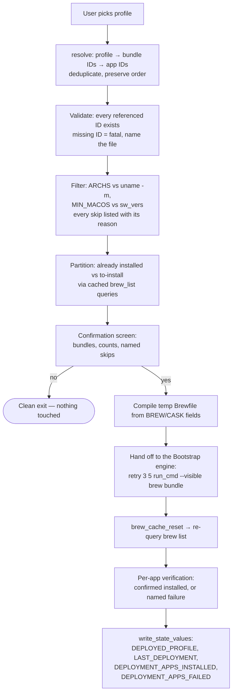

# Deployment — Design Document

Status: **All five phases delivered.** The Deployment module is complete: planning,
review, and installation through the Bootstrap engine, with the Installation
Transaction as the execution record. The final pipeline reference is
[Deployment-Architecture.md](Deployment-Architecture.md); this document remains the
design history.

## Thesis

**JB Toolkit prepares complete computers.** Deployment turns "set up this Mac for a
developer" into one decision, not forty. It is *not* a package manager — Homebrew is
the package manager, and Bootstrap owns the installation machinery. Deployment is the
layer that knows what a JB Repair workstation looks like and compiles that knowledge
down to the engine that already exists.

## Deployment is an orchestration layer — never an installer

This is the load-bearing constraint of the whole design:

```
Profile
    ↓
Bundle Resolution
    ↓
Application Resolution
    ↓
Temporary Brewfile
    ↓
Bootstrap Installation Engine  (brew bundle + retry + verify — unchanged)
```

Deployment's entire responsibility is **resolving data and orchestrating execution**.
It never talks to Homebrew directly for installation; it produces a temporary
Brewfile and hands it to the same proven pattern Bootstrap uses
(`retry 3 5 run_cmd --visible brew bundle`, post-run verification,
`brew_cache_reset`). If Deployment ever grows an installation code path of its own,
the design has been violated.

## Goals and non-goals

| Goals | Non-goals |
|---|---|
| One profile choice prepares a whole machine | Browsing/searching dozens of apps |
| Reusable bundles, zero duplicated package definitions | A second package database competing with Brewfiles |
| Curated JB Picks integrated into the same data | Ratings/reviews UI, app store aesthetics |
| Hardware-aware filtering (arch, macOS version) with visible skips | Cross-platform support (future goal; isolated seams only) |
| Menus generated from catalog data | Hardcoded menu logic per profile |
| Same architectural rules as every other module | New abstractions: no plugin system, no config framework |

## Architectural position

Deployment becomes the **fifth independent module**, equal to the existing four:



All existing rules apply unchanged: child process under the launcher,
standalone-capable via the `init_session` guard, zero dependencies on other modules,
results to Report through `state.env` only. It reuses the foundation as-is:
`run_cmd`, session logging, `ask_yes_no`, `parse_selection`, the Homebrew layer, and
hardware primitives.

Code layout (mirrors the bootstrap/maintenance pattern; each file one
responsibility):

```
core/deployment.sh              # Small dispatcher: CLI tools + interactive entry
core/deployment/
    catalog.sh                  # Catalog access, hierarchy queries, V1–V10 validator
    doctor.sh                   # Advisory maintainability diagnostics (never blocking)
    resolve.sh                  # Bundles → app IDs with provenance → filtered set
    planner.sh                  # Builds + exports the Deployment Plan (PLAN_* contract)
    render.sh                   # Pure presentation: summary/explain/tree/confirmation/result
    menu.sh                     # Catalog-generated navigation, Custom flow, JB Picks browser
    confirm.sh                  # Confirmation loop; [I] executes the plan
    transaction.sh              # Installation Transaction: the execution record
    install.sh                  # Executes the plan via the Bootstrap engine; verifies per app
    history.sh                  # FUTURE: browse deployment_txn_*.env records
```

### The Deployment Plan (Planner ↔ Installer contract)

`build_deployment_plan <profile>` (or `build_custom_plan <bundles>`) populates a
module-level plan — the **single source of truth for what would happen**. The
future installer executes an already-built plan and never makes decisions:

| Field | Content |
|---|---|
| `PLAN_PROFILE_ID` / `PLAN_PROFILE_NAME` / `PLAN_PROFILE_DESC` | Selected profile (`custom` for user-composed) |
| `PLAN_ARCH` / `PLAN_MACOS` | Compatibility context of this machine |
| `PLAN_BUNDLES` | Bundle IDs, resolution order |
| `PLAN_APPS` | `id\|name\|source-bundle` per line — **install order and provenance** |
| `PLAN_SKIPPED` | `id\|name\|source-bundle\|reason` per line — named, never silent |
| `PLAN_PICKS` | JB Pick app IDs within the plan |
| `PLAN_APP_COUNT` / `PLAN_SKIP_COUNT` / `PLAN_PICK_COUNT` | Verified counts |

The plan is fully renderable with no installer present: the **explain view**
(`render_plan`) shows every app with its source bundle and every skip with its
reason; the **tree view** (`render_plan_tree`) shows the catalog structure with
dedup/skip annotations for catalog maintenance; the **confirmation screen**
(`render_confirmation`) summarizes counts with installation explicitly disabled.

## The catalog

Four directories; three active layers plus one reserved:

```
catalog/
├── README.md                   # Technician quick-start
├── applications/               # One DIRECTORY per application
│   └── openlogi/
│       └── app.conf            # Metadata (the only required file)
├── bundles/                    # One file per bundle (app ID list)
├── profiles/                   # One file per profile (bundle ID list + placement)
└── vendors/                    # RESERVED — future deployment presets (see below)
```

Normative field-by-field contracts, parsing rules, and validation rules live in
**[Catalog-Format.md](Catalog-Format.md)**. The essentials:

### The directory is the application

Each application is a **directory**, not a file: `catalog/applications/<id>/` with
`app.conf` inside. Today `app.conf` is the only file; the directory deliberately
leaves room for future per-app assets — `README.md`, icons, screenshots, localized
descriptions, release notes, compatibility notes — without ever redesigning the
catalog. Tools must therefore resolve applications by directory and read
`<id>/app.conf`, never glob for `*.conf` files at the top level.

```bash
# catalog/applications/openlogi/app.conf
ID=openlogi
NAME=OpenLogi
CASK=openlogi
DESCRIPTION=Reemplazo open-source moderno de Logitech Options+
CATEGORIES=utilities drivers
JB_PICK=true
JB_PICK_NOTE=Nativo, ligero y sin cuenta requerida. Reemplaza Logi Options+ tras años de problemas de soporte.
```

Files remain **human-editable, shell-friendly flat `KEY=value`** — the `state.env`
convention, parseable with the same awk pattern as `state_value`. No YAML, no JSON,
no SQLite, ever. A technician with a text editor is a first-class catalog author.

### Strictly referential layers

**Profiles reference bundles; bundles reference applications; applications define
packages.** A Homebrew package name appears in exactly one place in the repository —
the `BREW=` or `CASK=` line of one `app.conf`. Profiles never name packages; bundles
never carry package metadata; everything resolves through application IDs.



## Hierarchical navigation — menus from data

Profiles place **themselves** in the menu tree with two keys:

```bash
# catalog/profiles/creative.profile
NAME=Creative
DESCRIPTION=Estación de trabajo para diseño y multimedia
CATEGORY=Professional
SUBCATEGORY=Creative
ORDER=20
BUNDLES=jb-essentials productivity media
```

Rendering contract (the UI has **no** profile-specific logic):

1. Menu level 1 lists the distinct `CATEGORY` values, ordered by `ORDER`
   (then alphabetically), plus the fixed entries `Custom` and `JB Picks`.
2. Selecting a category containing **exactly one profile without `SUBCATEGORY`**
   selects that profile directly — single-profile categories collapse to leaves.
3. Selecting a category with multiple profiles opens a submenu listing them by
   `SUBCATEGORY` (falling back to `NAME`), ordered the same way.
4. Maximum depth is two levels (`CATEGORY` → `SUBCATEGORY`). Growth beyond ~7 items
   at any level is handled by adding categories, not by deeper nesting.

The initial tree, generated entirely from the profile files below:

```
Deployment                      Professional
============================    ============================
¿Qué tipo de equipo             ¿Qué perfil profesional?
 preparamos?
                                1) Business
1) Home                         2) Creative
2) Office                       3) Engineering
3) Professional …               4) Education
4) Technician                   0) Volver
5) Developer
6) Custom
7) JB Picks ⭐
0) Volver
```

`Home`, `Office`, `Technician`, and `Developer` are single-profile categories
(collapse rule); `Professional` fans out. When Developer later splits into Web /
Python / DevOps, that happens by **adding profile files** with
`CATEGORY=Developer` + `SUBCATEGORY=…` — zero menu code changes. `Custom` is a UI
flow (compose bundles via `parse_selection`), not a profile file.

## JB Picks

JB Picks is **curation metadata on the application record** — `JB_PICK=true` plus a
mandatory `JB_PICK_NOTE`. There is no separate picks database to drift out of sync.

**Validity rule:** a pick without a justification is invalid. The Phase 3 catalog
validator rejects any `app.conf` with `JB_PICK=true` and a missing or empty
`JB_PICK_NOTE`. These are recommendations earned through years of supporting
customers, not favorites; the note — *why JB Repair recommends this* — is the
product.

Two purposes, one data source:

1. **Operational** — picks ship inside bundles like JB Essentials, installed through
   the normal resolution pipeline. Nothing special-cased.
2. **Educational** — a read-only **JB Picks browser** on the Deployment menu renders
   each pick with its reasoning:

   ```
   JB Picks ⭐
   ----------------------------------------
   ★★★★★ OpenLogi
      Reemplazo open-source moderno de Logitech Options+.
      Nativo, ligero y sin cuenta requerida.

   ★★★★★ PDFgear
      Editor PDF gratuito y completo.
      Cubre la mayoría de casos sin licencia de Acrobat.

   ★★★★★ Rectangle
      Gestión de ventanas con atajos de teclado.
   ```

   No installation happens from this screen. It answers exactly one question — *what
   does JB Repair actually recommend, and why* — and exists to build trust in the
   bundles. All picks render ★★★★★: either JB Repair stands behind an app or it
   isn't a pick. There are no three-star recommendations.

## The vendor layer (reserved, not implemented)

`catalog/vendors/` is **reserved architectural space** for future deployment
presets: named compositions of profiles for specific organizations — JB Repair's own
defaults, Business, Education, LCS, individual clients. A vendor will compose
existing profiles without modifying the catalog itself (the same relationship
profiles have to bundles, one level up).

Phase 2 ships only a `README.md` placeholder documenting this intent. No vendor
parsing, no vendor menus, no vendor keys — the directory exists so that when the
need arrives, it lands in prepared ground instead of forcing a catalog redesign.
Do not build against this layer until it is designed for real.

## Resolution and installation pipeline



## Truthfulness

The audited invariant carries over whole: **never silently skip; never report
estimates; always report verified outcomes.**

- An incompatible application is displayed at confirmation time with its reason —
  before the user commits, not buried in a log.
- After `brew bundle`, the module re-queries Homebrew (post-`brew_cache_reset`) and
  verifies **each application individually**. The result screen names everything:

  ```
  Resultado del despliegue
  ----------------------------------------
  Instaladas: 12 de 13

  Omitidas por compatibilidad:
     • OpenLogi — requiere macOS 15+

  Fallidas:
     • Docker Desktop — descarga interrumpida

  Ya estaban instaladas: 2
  ```

- State keys record **confirmed** counts only. A blanket "✔ Perfil desplegado" with
  a hidden failure is a design violation, not a cosmetic bug.

## User experience rules

- No menu exceeds roughly 7 visible entries.
- Every screen answers exactly one question.
- Depth over breadth: users navigate categories → profiles (→ bundles in Custom).
- **Individual applications appear only at the final confirmation stage** — never as
  a browsing surface. The one exception is the read-only JB Picks browser, which is
  educational, not operational.
- The experience is a deployment utility, not a package manager.

The launcher menu grows to six items (Deployment inserted before Report). A future
Settings entry appears in the long-term product sketch but is out of scope — menus
don't grow speculatively.

## New state keys (land in Phase 5)

| Key | Meaning |
|---|---|
| `DEPLOYED_PROFILE` | Profile ID of the last deployment |
| `LAST_DEPLOYMENT` | Timestamp of the last deployment run |
| `DEPLOYMENT_APPS_INSTALLED` | **Confirmed** newly-installed count |
| `DEPLOYMENT_APPS_FAILED` | Count of apps that did not verify after bundle |

Report will display "Perfil desplegado: <NAME>" alongside its existing sections.
Keys get added to the [State-System.md](State-System.md) inventory when they land.

## Phased implementation plan

Each phase is independently shippable and leaves the toolkit fully working. No phase
begins before the previous one is reviewed.

| Phase | Deliverable | Status |
|---|---|---|
| **1 — Foundations** | CONTRIBUTING.md; this design | ✅ Delivered |
| **2 — Contracts + data** | [Catalog-Format.md](Catalog-Format.md) data contracts; `catalog/` scaffolded: application directories, bundles, profiles, vendor placeholder; resolution diagrams; doc updates. **Pure documentation and data — no code** | ✅ Delivered |
| **3 — Loaders** | `core/deployment/catalog.sh` + `resolve.sh`: parse, validate (dangling IDs, duplicate IDs, BREW/CASK exclusivity, JB_PICK note rule), resolve profile → filtered app set; a `--validate` mode that walks the whole catalog. CLI-only entry `core/deployment.sh` (`--validate`, `--resolve <perfil>`), **not** wired into the launcher | ✅ Delivered |
| **4 — Planning and UX** | The complete deployment experience minus installation: catalog-generated menus (categories, collapse rule, Custom, JB Picks browser) wired into the `jb` launcher; the **Deployment Planner** and plan contract; the render layer (`render_*`); explain and tree views; the confirmation screen with install disabled. Zero system modification | ✅ Delivered |
| **5 — Installation engine** | `install.sh` + `transaction.sh`: executes the Deployment Plan — Brewfile compilation from plan records (which carry package specs; the installer never reads the catalog), hand-off to the Bootstrap engine pattern, per-app verification against a fresh Homebrew query, the Installation Transaction record, state keys, Report integration | ✅ Delivered |

Risk containment: Phase 2 is inert data; Phase 3 touches nothing the user can reach;
Phase 4 is reachable but cannot mutate a system; only Phase 5 installs, and it lands
on machinery Bootstrap has already proven in production.
