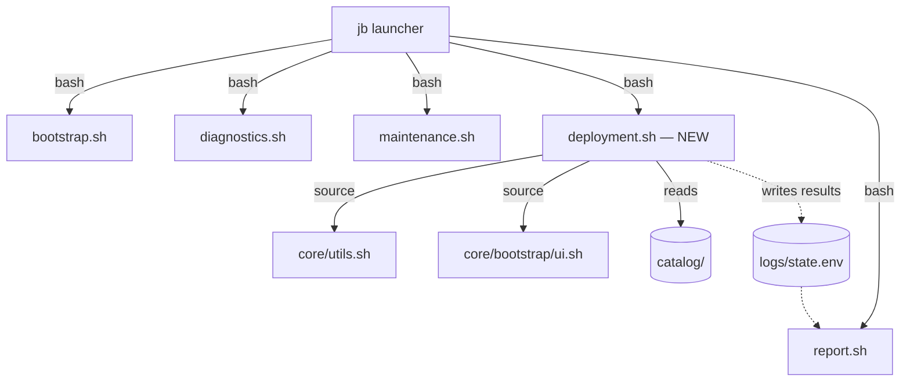
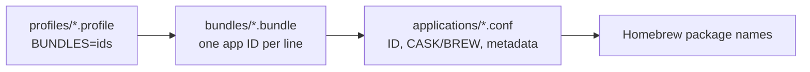
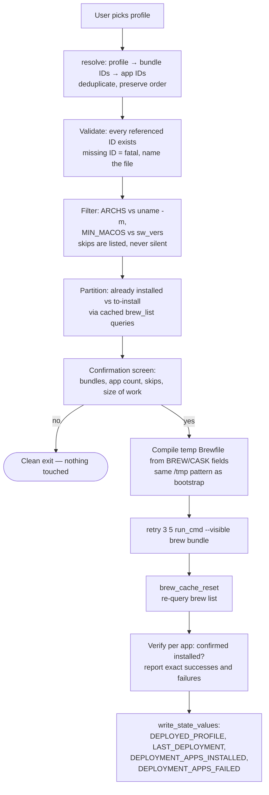

# Deployment — Design Document

Status: **DESIGN — not implemented.** This document is the agreed blueprint for the
Deployment module. Implementation follows the phased plan at the end; no phase begins
until this design is approved.

## Thesis

**JB Toolkit prepares complete computers.** Deployment turns "set up this Mac for a
developer" into one decision, not forty. It is *not* a package manager — Homebrew is
the package manager. Deployment is the layer that knows what a JB Repair workstation
looks like and compiles that knowledge down to the proven Bootstrap machinery.

## Goals and non-goals

| Goals | Non-goals |
|---|---|
| One profile choice prepares a whole machine | Browsing/searching dozens of apps |
| Reusable bundles, zero duplicated package definitions | A second package database competing with Brewfiles |
| Curated JB Picks integrated into the same data | Ratings/reviews UI, app store aesthetics |
| Hardware-aware filtering (arch, macOS version) | Cross-platform support (future goal, isolated seams only) |
| Same architectural rules as every other module | New abstractions: no plugin system, no config framework |

## Architectural position

Deployment becomes the **fifth independent module**, equal to the existing four:



All existing rules apply unchanged:

- Child process under the launcher; standalone-capable via the `init_session` guard.
- No dependency on any other module. Results flow to Report through `state.env` only.
- Reuses the foundation as-is: `run_cmd`, session logging, `ask_yes_no`,
  `parse_selection`, the Homebrew layer (`brew_available`, query cache,
  `brew_cache_reset`), and hardware primitives (`get_arch`, `get_device_profile`).

Planned file layout (mirrors the bootstrap/maintenance pattern):

```
core/deployment.sh              # Orchestrator: menu → resolve → confirm → install → verify
core/deployment/
    catalog.sh                  # Load/validate applications, bundles, profiles
    resolve.sh                  # Profile → bundles → app IDs → filtered install set
    install.sh                  # Compile to temp Brewfile, run bundle, verify
catalog/
    applications/               # One file per application (metadata)
    bundles/                    # One file per bundle (app ID list)
    profiles/                   # One file per profile (bundle ID list)
```

## Data model — the catalog

Three layers, strictly referential: **profiles reference bundles; bundles reference
applications; applications define packages.** A package name appears in exactly one
place in the repository.



File formats follow the `state.env` convention — flat `KEY=value`, parseable with
the same awk pattern as `state_value`. No YAML, no JSON, no new parsers.

### Application (`catalog/applications/<id>.conf`)

```bash
# catalog/applications/keka.conf
ID=keka
NAME=Keka
CASK=keka                    # or BREW=<formula> — exactly one of the two
DESCRIPTION=Compresor y descompresor moderno y ligero
CATEGORIES=utilities
JB_PICK=5                    # 1–5; omit when not a JB Pick
JB_PICK_NOTE=Reemplazo moderno de The Unarchiver
ARCHS=arm64 x86_64           # omit = all architectures
MIN_MACOS=12                 # omit = any supported macOS
RECOMMENDED=true             # surfaced first in Custom flow; omit = false
```

```bash
# catalog/applications/openlogi.conf
ID=openlogi
NAME=OpenLogi
CASK=openlogi
DESCRIPTION=Reemplazo open-source moderno de Logitech Options+
CATEGORIES=utilities drivers
JB_PICK=5
JB_PICK_NOTE=Recomendado tras años de soporte con periféricos Logitech
```

Field semantics:

| Field | Required | Meaning |
|---|---|---|
| `ID` | yes | Kebab-case, must equal the filename stem |
| `NAME` | yes | Display name (Spanish UI uses it as-is) |
| `BREW` / `CASK` | exactly one | The Homebrew package — the **single source of truth** |
| `DESCRIPTION` | yes | One line, Spanish, shown in confirmation and JB Picks |
| `CATEGORIES` | no | Space-separated tags (informational + Custom flow grouping) |
| `JB_PICK` / `JB_PICK_NOTE` | no | Curation rating and the "why" — see JB Picks |
| `ARCHS` | no | Space-separated `uname -m` values; installer skips incompatible |
| `MIN_MACOS` | no | Major version; installer skips older systems |
| `RECOMMENDED` | no | Ordering hint inside Custom selection |

### Bundle (`catalog/bundles/<id>.bundle`)

One application ID per line; `#` comments; first comment line is the display name.

```bash
# JB Essentials
appcleaner
keka
rectangle
stats
pdfgear
openlogi
```

```bash
# Developer Bundle
git
visual-studio-code
node
pnpm
docker
```

```bash
# Networking Bundle
tailscale
wireshark
nmap
angry-ip-scanner
```

### Profile (`catalog/profiles/<id>.profile`)

```bash
# catalog/profiles/developer.profile
NAME=Developer
DESCRIPTION=Estación de trabajo para desarrollo de software
BUNDLES=jb-essentials developer
```

```bash
# catalog/profiles/engineering.profile
NAME=Engineering
DESCRIPTION=Perfil profesional para ingeniería
GROUP=professional
BUNDLES=jb-essentials productivity engineering
```

`GROUP` is the one nesting mechanism: profiles without a group appear on the
Deployment menu; grouped profiles appear on their group's submenu. This keeps every
menu ≤ 7 items with **data, not code** — adding a profile never means editing a menu.

Initial catalog (from the product definition):

| Menu level 1 | Menu level 2 (`GROUP=professional`) |
|---|---|
| Home | Business |
| Office | Creative |
| Professional → | Engineering |
| Technician | Education |
| Developer | |
| Custom | |

Profile → bundle composition (no package appears twice anywhere):

| Profile | Bundles |
|---|---|
| Developer | JB Essentials + Developer |
| Office | JB Essentials + Productivity |
| Technician | JB Essentials + Networking |
| Home | JB Essentials |
| Business / Creative / Engineering / Education | JB Essentials + Productivity + one specialty bundle |

## JB Picks

JB Picks is **curation data, not a data store**. The rating lives on the application
record (`JB_PICK`, `JB_PICK_NOTE`) — there is no separate picks list to drift out of
sync. Two integration points:

1. **A read-only showcase screen** (reached from the Deployment menu): applications
   with `JB_PICK` set, sorted by rating, displayed as
   `★★★★★ OpenLogi — Reemplazo open-source moderno de Logitech Options+` with the
   curation note. It answers one question: *what does JB Repair actually recommend,
   and why.* No installation happens from this screen; it exists to build trust in
   the bundles.
2. **The JB Essentials bundle** is the operational form of the five-star picks —
   the picks integrate with deployment *through* a bundle, like everything else.

The `JB_PICK_NOTE` is required when `JB_PICK` is set: a pick without a reason is a
favorite, not a recommendation. Years-of-support rationale is the product.

## Resolution and installation pipeline



Design decisions worth naming:

- **The installation engine is the Bootstrap engine.** Deployment compiles the
  resolved set into a temporary Brewfile and reuses the proven
  `brew bundle` + retry + verify pattern. No new installer, no per-package loops to
  get wrong. (The shared helpers this needs from `bootstrap/brew.sh` are promoted to
  `utils.sh` only if Phase 5 shows they're needed verbatim — per the consolidation
  rule.)
- **Truthful accounting, as audited.** After `brew bundle`, the module re-queries
  Homebrew (post-`brew_cache_reset`) and reports *confirmed* installs. "Instaladas:
  12 de 13" with the failure named beats a blanket success. State keys record
  confirmed counts only.
- **Filtering is visible.** An app skipped for architecture or macOS version is
  listed on the confirmation screen ("Omitidas por compatibilidad: …"), honoring the
  no-silent-behavior principle.
- **Custom profile** reuses `parse_selection` over the bundle list (≤ 7 bundles per
  screen) — the user composes bundles, never individual apps. Composing apps is what
  the Bootstrap optional-packages flow already offers.

## User experience

Every screen answers exactly one question. Depth over breadth; no menu exceeds ~7
visible items; navigation feel matches the existing launcher.

```
JB Toolkit                      Deployment                    Professional
==============================  ============================  ============================
1) Initial Setup                ¿Qué tipo de equipo           ¿Qué perfil profesional?
2) Diagnostics (Scan System)     preparamos?
3) Maintenance (Fix Issues)                                   1) Business
4) Deployment (Prepare Mac)     1) Home                       2) Creative
5) Report (Export Results)      2) Office                     3) Engineering
6) Exit                         3) Professional …             4) Education
                                4) Technician                 0) Volver
                                5) Developer
                                6) Custom
                                7) JB Picks ⭐
                                0) Volver
```

Confirmation is the only dense screen, and it is a summary, not a list of forty
apps:

```
Perfil: Developer
----------------------------------------
• JB Essentials        6 aplicaciones
• Developer Bundle     5 aplicaciones

Nuevas: 9   Ya instaladas: 2   Omitidas por compatibilidad: 0

¿Preparar este equipo? (y/n):
```

The result screen mirrors maintenance's executive summary: confirmed counts, named
failures, elapsed time, `print_completion`. Report picks up the state keys and shows
"Perfil desplegado: Developer" alongside the existing sections.

The launcher menu grows to six items (Deployment inserted before Report). A Settings
entry appears in the long-term product sketch but is **out of scope** for this design
— nothing here needs it, and menus don't grow speculatively.

## New state keys

| Key | Meaning |
|---|---|
| `DEPLOYED_PROFILE` | Profile ID of the last deployment |
| `LAST_DEPLOYMENT` | Timestamp of the last deployment run |
| `DEPLOYMENT_APPS_INSTALLED` | **Confirmed** newly-installed count |
| `DEPLOYMENT_APPS_FAILED` | Count of apps that did not verify after bundle |

(Added to the State-System key inventory when Phase 5 lands.)

## Phased implementation plan

Each phase is independently shippable, reviewable, and leaves the toolkit fully
working. No phase begins before the previous one is merged.

| Phase | Deliverable | Proof it works |
|---|---|---|
| **1 — Foundations** *(this document)* | `CONTRIBUTING.md`; this design; agreed file formats | Design review |
| **2 — Catalog data** | `catalog/` populated: application records (with JB Picks metadata), the initial bundles, the eight profiles. Pure data — no code | Files validate against the format spec by inspection |
| **3 — Loaders** | `core/deployment/catalog.sh` + `resolve.sh`: parse, validate (dangling IDs, duplicate IDs, BREW/CASK exclusivity), resolve profile → filtered app set | A `--validate` invocation that walks the whole catalog and reports; run in CI-less fashion via `bash -n` + manual run |
| **4 — Interactive module** | `core/deployment.sh` menus (profiles, groups, Custom, JB Picks showcase) wired into the `jb` launcher; ends at the confirmation screen with a "installation engine pending" notice | Full navigation on a real machine; decline paths clean |
| **5 — Installation engine** | `install.sh`: Brewfile compilation, `brew bundle` execution, post-verification, state keys, Report integration | End-to-end deployment on a test Mac; session log shows CMD/EXIT evidence; Report displays the new keys |

Risk containment: phases 2–3 touch nothing the user can reach; phase 4 is reachable
but inert; only phase 5 mutates a system, and it lands on machinery (bundle + retry +
verify) that Bootstrap has already proven in production.
