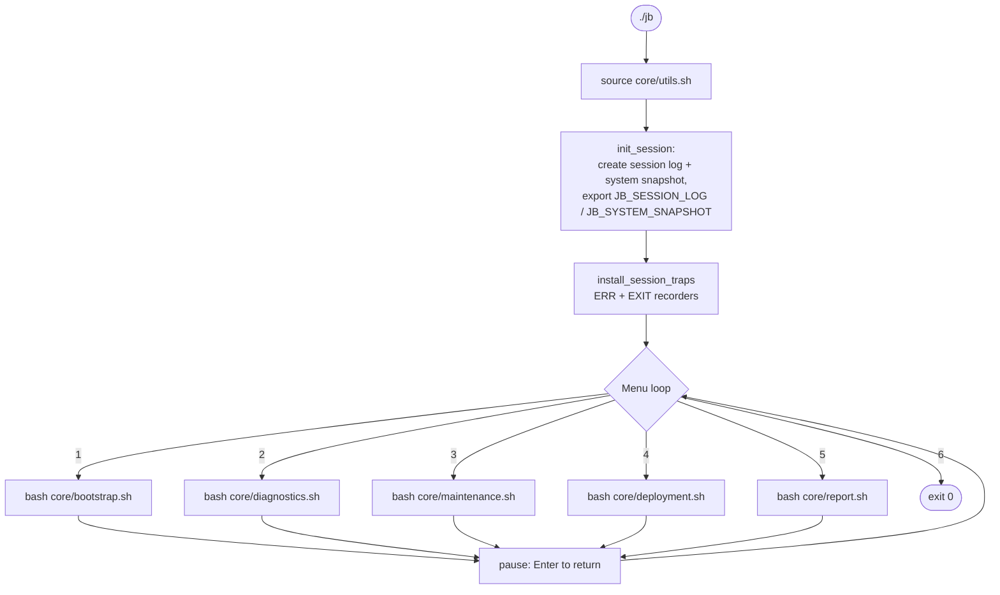
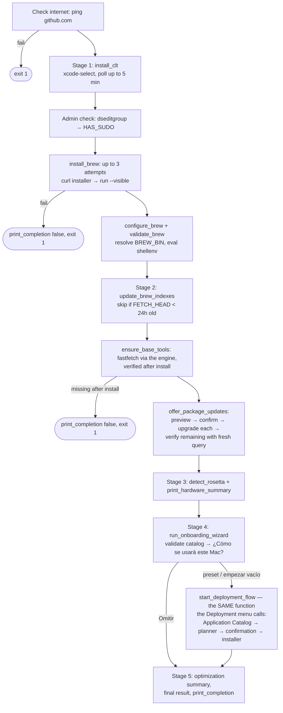
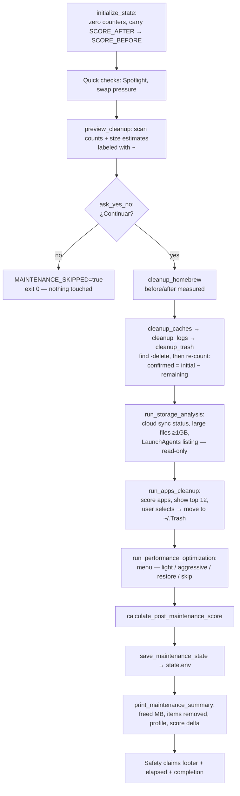
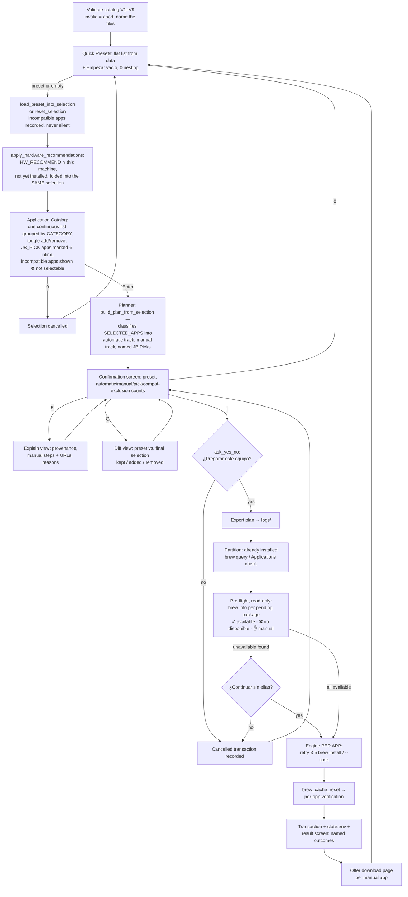

# Execution Flow

## Launcher lifecycle (`jb`)

Details that matter:

- `init_session` runs **once per launcher session**. It creates
  `logs/session_<stamp>.log`, generates `logs/system_snapshot_<stamp>.txt`, records
  both basenames in `state.env`, and prunes each artifact family to the 20 most
  recent. Modules inherit the session via exported environment variables; their own
  `init_session` call is a guard that only fires when run standalone.
- `run_script` logs launch/exit of each module and prints an error line if the module
  exits non-zero — but returns to the menu either way. A failed module never kills
  the launcher.
- `Ctrl-C` is trapped to a clean "👋 Saliendo…" exit.

## Module 1 — Bootstrap (`core/bootstrap.sh`)

Five user-visible stages (`print_stage`, counter `[n/5]` with per-stage elapsed
time). Bootstrap owns the machine's base tooling; all software selection lives in
the Deployment library, reached through the onboarding wizard.

Bootstrap is the only module with hard abort points: everything downstream of a
missing Homebrew or missing base tools would be meaningless. An invalid catalog
does **not** abort Bootstrap — the wizard is skipped with a warning, because the
base setup is still valuable.

## Module 2 — Diagnostics (`core/diagnostics.sh`)

1. `fastfetch` system summary if installed; otherwise a manual CPU/RAM/disk/uptime
   summary built from `sysctl`, cached score metrics, `df`, and `uptime`.
2. `calculate_health_score` — one call computes the score **and** caches
   `SYS_CPU_LOAD`, `SYS_RAM_PCT`, `SYS_DISK_PCT` for reuse (single measurement,
   consistent display).
3. Top-5 unique processes by CPU (`ps` + dedupe by lowercased basename).
4. Health score rendered as a 10-segment bar with color-coded status label.
5. State write: `SCORE_BEFORE`/`SCORE_AFTER` (both set to the current score — a
   diagnostic defines the new baseline), `LAST_DIAGNOSTIC`, cached metrics.
6. Executive summary (threshold-based bullets) and a recommendation to run
   Maintenance.

Diagnostics is **read-only** with respect to the system; its only writes are
`state.env` and the session log.

## Module 3 — Maintenance (`core/maintenance.sh`)

The decline path is a first-class flow: preview → "no" → zero mutations → clean exit.

## Module 4 — Deployment (`core/deployment.sh`)

One workflow, one selection model — see
[Deployment-Architecture.md](Deployment-Architecture.md) and
[architecture/0006-deployment-flattening.md](architecture/0006-deployment-flattening.md)
for why this replaced the earlier Profiles→Bundles→Applications hierarchy.

The planner is the only decision-maker past selection; the installer executes
plan records verbatim (they carry method + package specs — it never reads the
catalog). Each application installs independently: one failure or unavailable
package never aborts the rest. Results are **verified outcomes**: installed
counts come from a fresh Homebrew query, manual steps are named and never
counted as failures, failures carry their reasons, and the Installation
Transaction (`logs/deployment_txn_*.env`) records what actually happened. CLI:
`--validate`, `--doctor`, `--resolve`, `--explain`, `--tree`, `--plan` — six
representations of the same plan (CLI plans load a preset with zero manual
edits; the Application Catalog is interactive-only).

## Module 5 — Report (`core/report.sh`)

1. Double-run guard: `JB_REPORT_ALREADY_RUN` env check.
2. System section: fastfetch (host/OS) or fallback, CPU, RAM (own measured
   calculation), disk (single `df -H /`), Homebrew formula/cask counts (cached
   queries).
3. Score comparison: `SCORE_BEFORE` vs `SCORE_AFTER` from `state.env` with delta.
4. Summary section driven entirely by `state.env` values (`TOTAL_FREED_MB`,
   `FILES_REMOVED`, `PERFORMANCE_PROFILE`, `LAST_MAINTENANCE`), each guarded
   against `N/A`.
5. Optional PDF: checks `reportlab`, offers `pip install --user`, exports
   `JB_PDF_OUTPUT`, runs `report_pdf.py`, verifies the file exists before claiming
   success, records `LAST_PDF_REPORT`.
6. Generated-artifacts listing: PDF, snapshot, session log — each verified with
   `-f` before being reported as available.

See [Reporting.md](Reporting.md) for the data pipeline.
