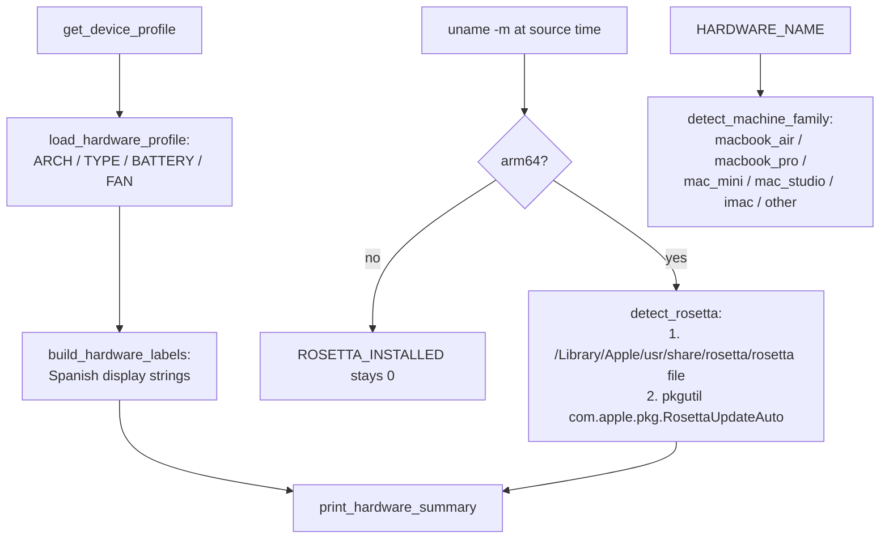

# Hardware Detection

Hardware awareness drives deployment compatibility filtering, hardware-based
package recommendations, app risk scoring, and performance-profile branching.
Detection lives in two layers:
primitives in `core/utils.sh` (available to every module) and presentation /
bootstrap-specific logic in `core/bootstrap/hardware.sh`.

## Primitives (`core/utils.sh`)

| Function | Method | Result |
|---|---|---|
| `load_hardware_info` | `sysctl hw.model` + `system_profiler SPHardwareDataType` "Model Name" (memoized) | `HARDWARE_MODEL` (identifier), `HARDWARE_NAME` (marketing name; falls back to model ID) |
| `get_arch` | `uname -m` | `apple_silicon` / `intel` / `unknown` |
| `is_laptop` | `HARDWARE_NAME` contains "MacBook" | laptop vs desktop |
| `has_battery` | `pmset -g batt` contains "InternalBattery" | battery presence |
| `has_fan` | Model heuristics (12″ Retina MacBook → no; desktops & MacBook Pro → yes) then `system_profiler` sensor fallback | fan presence |
| `has_external_display` | `system_profiler SPDisplaysDataType` resolution count > 1 | external display |
| `get_device_profile` | Composes the above | `KEY=value` lines: `MODEL_NAME`, `MODEL_ID`, `ARCH`, `TYPE`, `BATTERY`, `FAN` |

Normalization rule: laptops always report `BATTERY=yes` even if `pmset` fails —
a MacBook without a detected battery is a sensor failure, not a desktop.

## Bootstrap layer (`core/bootstrap/hardware.sh`)

`detect_rosetta` deliberately avoids `pgrep oahd` (process-presence is unreliable —
Rosetta can be installed but idle): it checks the runtime binary on disk first
(fast), then falls back to the package receipt (authoritative).

## Hardware-driven behavior map

| Decision | Input | Where |
|---|---|---|
| Deployment compatibility skips (`ARCHS`) | `uname -m` vs catalog data | `app_incompatibility_reason` (resolve.sh) |
| Hardware recommendations | machine family + external display vs `HW_RECOMMEND` catalog data | `offer_hardware_extras` (deployment/menu.sh) |
| App risk: Intel-only penalty (+35) | module arch check + per-app binary inspection | apps.sh |
| Siri tweaks (aggressive profile) | Intel only | performance.sh |
| Rosetta status line | Apple Silicon only | `print_hardware_summary` |
| Laptop vs desktop profile summary | `BATTERY` | `print_optimization_summary` |

### Hardware recommendations (`offer_hardware_extras` + `HW_RECOMMEND`)

The matching is **catalog data**: an application's `HW_RECOMMEND` field lists the
machine families it is recommended for (`macbook_air`, `macbook_pro`, `mac_mini`,
`mac_studio`, `imac`) plus the pseudo-family `external_display`, which matches any
machine with more than one display. The current catalog encodes:

| Application | `HW_RECOMMEND` |
|---|---|
| AlDente | `macbook_air macbook_pro` |
| Macs Fan Control | `macbook_pro mac_mini mac_studio imac` |
| BetterDisplay | `mac_mini mac_studio external_display` |

Applications already verified as installed (Homebrew query) are excluded from the
offer. Accepted recommendations enter the Deployment Plan as extras with
provenance `hardware`, subject to the same compatibility filter as everything
else. Changing what gets recommended for which machine is a catalog edit, not a
code change.

## Intel-only app detection (`is_intel_only_app`, apps.sh)

1. Read `CFBundleExecutable` from `Contents/Info.plist` via PlistBuddy to find the
   **primary** executable (avoids misclassifying an app by its helper binaries).
2. Run `file` on that executable (or on `Contents/MacOS/*` as fallback).
3. Classification: contains `x86_64` **and not** `arm64` → Intel-only.
   Universal binaries (both architectures) and native arm64 apps are excluded.

## Per-module architecture variables

Each module process performs its own cheap arch check at source time
(`APPLE_SILICON` in apps.sh, `IS_APPLE_SILICON` in performance.sh and hardware.sh).
This is deliberate: modules are separate processes, the check is one `uname -m`,
and sharing it would add coupling without removing code
(see [Design-Principles.md](Design-Principles.md), principle 7).
