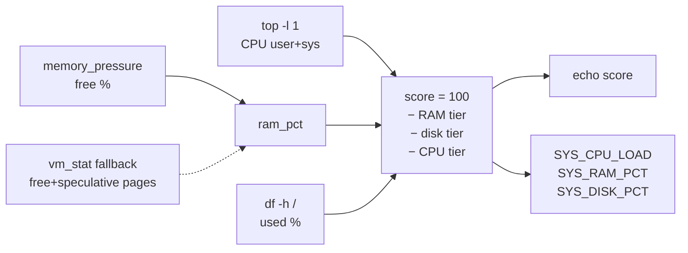

# Health Score

`calculate_health_score()` (`core/utils.sh`) produces a 0–100 integer summarizing
current system pressure. It is the single scoring implementation used by
Diagnostics (display + baseline) and Maintenance (before/after comparison).

## Inputs

| Metric | Source | Fallback |
|---|---|---|
| CPU usage | `top -l 1` → user% + sys% | `0%` when unparseable |
| RAM free % | `memory_pressure` → "System-wide memory free percentage" | `vm_stat` free + speculative pages → free % (same semantics as primary) |
| Disk usage % | `df -h /` fifth column | `0` when unavailable |

RAM derivation: `used_mb = total_mb × (100 − free%) / 100`, then
`ram_pct = used_mb × 100 / total_mb`. Total RAM comes from `sysctl hw.memsize`;
a zero total yields `ram_pct = 0` rather than a division error. Both the
`memory_pressure` path and the `vm_stat` fallback produce a **free percentage**,
so the shared formula is valid in both paths (this was audit finding F-03; the
fallback previously inverted the value).

## Scoring model

Start at **100**, subtract per pressure tier:

| Metric | Threshold | Deduction |
|---|---|---|
| RAM used | > 85 % | −25 |
| | > 70 % | −10 |
| Disk used | > 90 % | −25 |
| | > 80 % | −10 |
| CPU load | > 80 % | −15 |
| | > 50 % | −5 |

Floor at 0. Maximum possible deduction: 65.

## Metric cache contract

Alongside returning the score, the function stores the exact measured values in
`SYS_CPU_LOAD`, `SYS_RAM_PCT`, `SYS_DISK_PCT`. Callers that display metrics
(diagnostics summary, state write) read these instead of re-measuring, so **the
displayed numbers always match the numbers that produced the score**.

## Display tiers (diagnostics)

| Score | Status | Color |
|---|---|---|
| ≥ 95 | Excelente | green |
| ≥ 85 | Muy bueno | green |
| ≥ 70 | Bueno | yellow |
| < 70 | Requiere atención | red |

Rendered as a 10-segment bar (`█`/`░`), rounded to the nearest segment.

## Known characteristics (accepted, documented)

- **CPU is a snapshot.** One `top -l 1` sample; a transient spike or idle moment can
  move the score by up to 15 points. Acceptable for a quick technician triage;
  do not interpret single-run deltas of ≤ 15 points as meaningful.
- **RAM on macOS is intentionally approximate.** macOS keeps memory "used" by design
  (compressed/cached pages); `memory_pressure`'s free percentage is the closest
  supported proxy for real pressure.
- The maintenance flow measures the post-score immediately after cleanup; freed disk
  space rarely crosses a scoring tier, so "Score estable" is the common, honest
  outcome.
