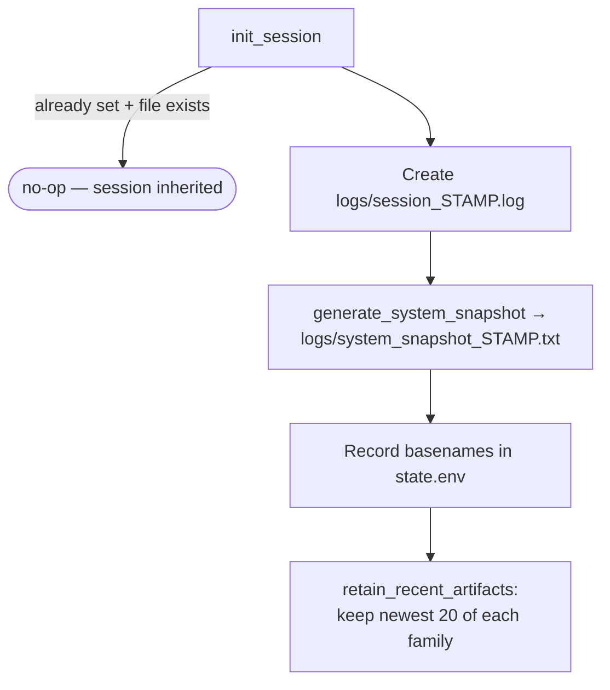

# Logging

The toolkit maintains one **session log** per launcher session, designed to be handed
to a technician: it records every status message, every executed command with its
output and exit code, and every unexpected error.

## Session lifecycle



- The launcher owns the session; `JB_SESSION_LOG` / `JB_SYSTEM_SNAPSHOT` are exported
  so all four modules append to the **same** log.
- Modules call `init_session` too, but it returns immediately when the inherited
  session exists — the call only matters when a module is run standalone, where it
  creates a fallback session so logging never silently disappears.

## Log entry format

```
YYYY-MM-DD HH:MM:SS [LEVEL] [Module] message
```

- `LEVEL` ∈ `INFO`, `SUCCESS`, `WARNING`, `ERROR`, `CMD`, `EXIT`.
- `Module` is set by `set_ui_context` → `set_session_module` (`Launcher`,
  `Bootstrap`, `Diagnostics`, `Maintenance`, `Report`).
- `session_write` is a no-op when no session exists and never fails the caller
  (`|| true` on the append).

## What gets logged, and by whom

| Source | Level(s) | Notes |
|---|---|---|
| `success` / `warn` / `info` / `error_msg` (ui.sh) | SUCCESS / WARNING / ERROR / INFO | Every user-visible status line is mirrored to the log |
| `log` (utils.sh) | Inferred from emoji: `❌`→ERROR, `⚠️`→WARNING, `✔`→SUCCESS, else INFO | Timestamped terminal output + log mirror |
| `run_cmd` | CMD, then EXIT | See below |
| `install_session_traps` (launcher) | ERROR on `ERR`, EXIT on `EXIT` | Records `command | exit code | line` |
| Orchestrators | INFO | Phase markers, e.g. `Running cleanup.sh` |

## `run_cmd` — the command execution wrapper

`run_cmd [--visible] cmd args…` is the standard way to execute state-changing
commands:

1. Quotes the full command (`shell_quote_command`, `printf %q`) and logs it as `CMD`.
2. Runs it with `set +e` protection, capturing output to a temp file.
   - Default: output hidden from the terminal.
   - `--visible`: output streamed via `tee` (used for the Homebrew installer and
     per-application `brew install`, which show progress).
3. Appends the captured output to the session log, indented four spaces.
4. Logs `EXIT <code>` and returns the real exit code to the caller.

This means the session log contains a **complete, replayable record** of what the
toolkit executed and what each command printed — the raw evidence behind every
success message.

## Artifact retention

`retain_recent_artifacts <glob> <keep>` prunes `logs/` by name-sorted recency.
Current policy: 20 session logs, 20 snapshots. PDFs are not pruned.

## Conventions for contributors

- Route state-changing commands through `run_cmd`; reserve bare execution for pure
  queries already wrapped in `$( … 2>/dev/null )`.
- Use the ui.sh helpers instead of raw `echo` for status lines so the log stays
  complete.
- Log messages describe **what actually happened** — after the truthfulness audit,
  message text must not claim more than the code verified (e.g., the aggressive
  profile reports the light optimizations it includes because it genuinely applies
  them via `apply_light_optimization`).
