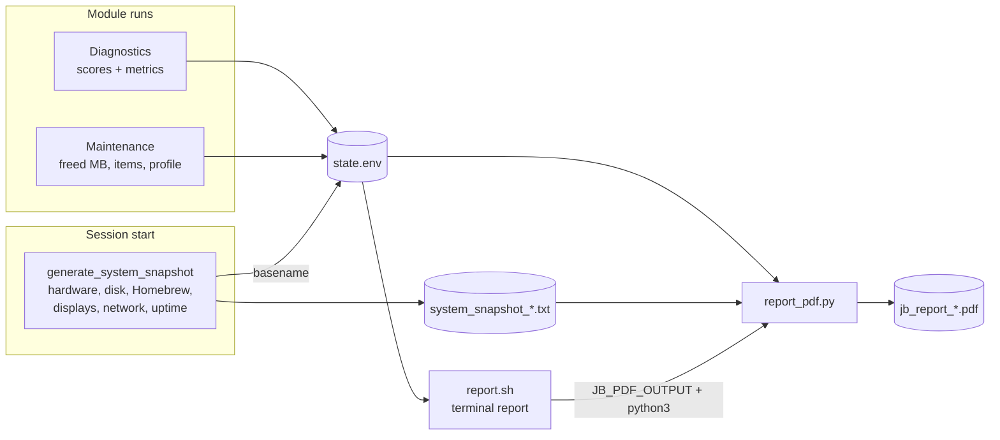

# Reporting

Reporting has three artifacts, all under `logs/`:

| Artifact | Producer | Audience |
|---|---|---|
| `session_<stamp>.log` | every module, continuously | technician / support |
| `system_snapshot_<stamp>.txt` | `generate_system_snapshot` at session start | inventory record; PDF input |
| `jb_report_<stamp>.pdf` | `report_pdf.py`, on demand from Report module | client deliverable |

## Data pipeline

The PDF generator is a **pure consumer**: it re-reads what Bash measured and
persisted rather than re-measuring, so the PDF always matches what the user saw in
the terminal during the actual maintenance run.

## System snapshot contents

Generated once per session (`generate_system_snapshot`, utils.sh): toolkit version,
macOS version, model, CPU, RAM, disk capacity/used/available/percent (single
`df -H /` call), volume name and filesystem (diskutil), architecture, uptime,
Homebrew version + formula/cask counts (cached queries), fastfetch version,
displays with resolutions, network interfaces. Every field has an explicit
`Unavailable` fallback — the snapshot never fails the session
(`init_session` logs a warning and continues if it cannot complete).

## Terminal report flow (`core/report.sh`)

1. **Double-run guard** — `JB_REPORT_ALREADY_RUN` prevents duplicate output in one
   process chain.
2. **System section** — fastfetch (Host, OS/Kernel/Uptime/Display) when available,
   with fallbacks; CPU via sysctl; RAM measured directly (see below); disk from one
   `df -H /` call, with unit expansion (`G`→`GB`).
3. **Homebrew section** — formula/cask counts from the session query cache.
4. **Results section** — `SCORE_BEFORE` vs `SCORE_AFTER` with delta, guarded for
   `N/A`.
5. **Summary section** — driven by `state.env`: tiered system-state line, last
   maintenance time, space recovered (MB→GB formatting), items removed, applied
   profile. Every value is guarded; missing data produces an honest "no previous
   score recorded" style message, never a fabricated number.
6. **PDF offer** — see below.
7. **Artifacts section** — lists PDF / snapshot / session log, each verified with
   `-f` before being reported as available.

### Report's own RAM calculation

`report.sh` measures RAM independently of the health score because it needs
different outputs (GB used / GB total / percent for display, not a scoring input).
Primary source is `memory_pressure` free %; the `vm_stat` fallback computes
`USED_MB = TOTAL_MB − FREE_MB` by direct subtraction. This duplication is
deliberate — see [Design-Principles.md](Design-Principles.md), principle 7.

## PDF generation

Flow in `report.sh`:

1. `python3 -c "import reportlab"` — dependency probe via `run_cmd` (logged).
2. If missing: offer `pip install --user reportlab`; a failed install downgrades
   gracefully (PDF skipped with a warning, report continues).
3. Export `JB_PDF_OUTPUT=$BASE_DIR/logs/jb_report_<stamp>.pdf`.
4. Run `core/report_pdf.py`; success requires **both** exit 0 **and** the output
   file existing before `LAST_PDF_REPORT` is recorded and success is claimed.

`report_pdf.py` reads `state.env` by key (`get_state_value`, `N/A` default) and
parses the snapshot file recorded in `LAST_SYSTEM_SNAPSHOT` (`Key: value` lines)
to build the client-facing document with reportlab.
