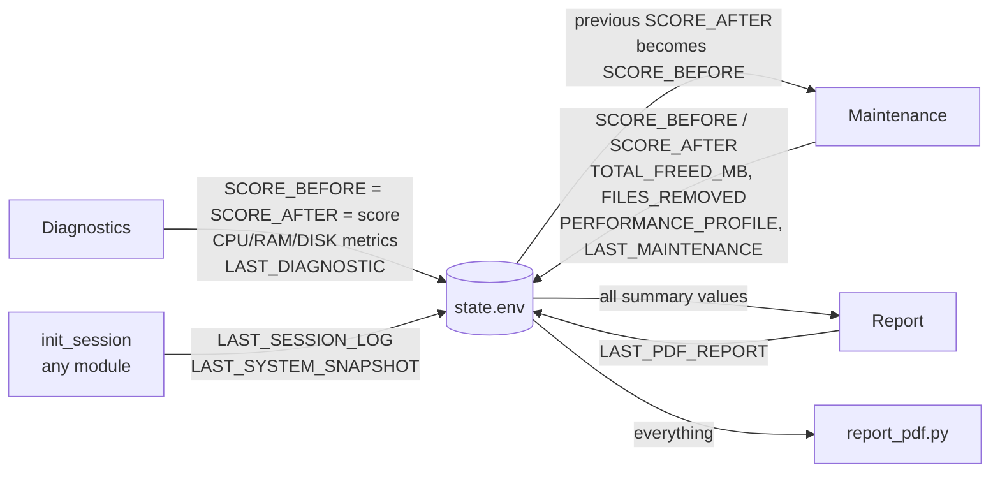

# State System

Because modules run as separate child processes, **`logs/state.env` is the only
data channel between them** (besides the exported session variables). It is a flat
`KEY=value` file, one pair per line.

## API (`core/utils.sh`)

| Function | Behavior |
|---|---|
| `state_value KEY` | Awk lookup by exact key. Returns the value after the first `=`; prints `N/A` when the key or file is missing. Values may contain `=`. |
| `write_state_values "K1=v1" "K2=v2" …` | Copies the current file to a temp file, removes each incoming key, appends the new pairs, then `mv`s the temp file over `state.env`. Update-in-place semantics: **unrelated keys are preserved.** |

Design notes:

- The temp-file + `mv` pattern gives whole-file replacement (no partial writes on
  interruption). There is no locking; concurrent module runs are not a supported
  scenario (the launcher is serial).
- `N/A` is the universal "absent" sentinel. Every consumer checks for it explicitly
  before treating a value as numeric (`[[ "$X" =~ ^[0-9]+$ ]]` or `!= "N/A"`).

## State flow between modules

## Key inventory

| Key | Written by | Read by | Meaning |
|---|---|---|---|
| `SCORE_BEFORE` | diagnostics, maintenance | maintenance, report | Health score baseline (0–100) |
| `SCORE_AFTER` | diagnostics, maintenance | maintenance (as next baseline), report | Most recent health score |
| `TIMESTAMP` | diagnostics, maintenance | — | Last state write time |
| `LAST_DIAGNOSTIC` | diagnostics | — | Last diagnostics run time |
| `LAST_MAINTENANCE` | maintenance | report | Last maintenance run time |
| `TOTAL_FREED_MB` | maintenance | report | Confirmed MB freed in last maintenance |
| `FILES_REMOVED` | maintenance | report | Confirmed items removed |
| `PERFORMANCE_PROFILE` | maintenance | report | `none` / `light` / `aggressive` / `default` |
| `LAST_MODULE` | diagnostics, maintenance | — | Last module that wrote state |
| `LAST_DURATION` | maintenance | — | Elapsed seconds of last maintenance |
| `ARCH` | diagnostics, maintenance | — | `uname -m` at write time |
| `JB_VERSION` | maintenance (from `$JB_VERSION`) | — | Toolkit version that wrote the state |
| `CPU_LOAD`, `RAM_USED_PCT`, `DISK_USED_PCT` | diagnostics | report_pdf.py | Cached metrics from the score calculation |
| `LAST_SESSION_LOG` | `init_session` | report | Basename of current session log |
| `LAST_SYSTEM_SNAPSHOT` | `init_session` | report, report_pdf.py | Basename of current snapshot |
| `LAST_PDF_REPORT` | report | — | Basename of last generated PDF |
| `DEPLOYED_PROFILE` | deployment | report | Profile ID of the last executed deployment |
| `LAST_DEPLOYMENT` | deployment | report | Timestamp of the last deployment execution |
| `DEPLOYMENT_APPS_INSTALLED` | deployment | report | **Confirmed** newly-installed count (post-verification) |
| `DEPLOYMENT_APPS_FAILED` | deployment | report | Apps that did not verify after `brew bundle` |
| `LAST_DEPLOYMENT_PLAN` | deployment | — | Basename of the exported plan (`logs/deployment_plan_*.env`) |
| `LAST_DEPLOYMENT_TRANSACTION` | deployment | future history/support | Basename of the execution record (`logs/deployment_txn_*.env`) |

## Score baseline handoff

The `SCORE_BEFORE`/`SCORE_AFTER` pair implements a simple baseline chain:

1. Diagnostics measures once and writes the score to **both** keys — a diagnostic
   defines a new baseline.
2. Maintenance starts by promoting the stored `SCORE_AFTER` to its in-memory
   `SCORE_BEFORE` (`initialize_state`), performs its work, measures a fresh
   `SCORE_AFTER` (`calculate_post_maintenance_score`), and persists both.
3. Report displays the pair and the delta, guarding against non-numeric (`N/A`)
   values.

If the post-maintenance measurement fails, `SCORE_AFTER` falls back to
`SCORE_BEFORE` (stable score, no fake improvement) and a warning is logged — another
instance of the "never report what wasn't measured" principle.

## In-memory state (process-scoped, not persisted)

These globals coordinate within a single module run only:

- Counters: `TOTAL_FREED_MB`, `FILES_REMOVED` (zeroed by `initialize_state`,
  accumulated by cleanup functions and `move_apps_to_trash`).
- Caches: `_BREW_LIST_*` / `_BREW_OUTDATED_*` (+ `_LOADED` flags),
  `APP_METADATA_CACHE`, `LARGE_FILES_CACHE`, `HARDWARE_MODEL`/`HARDWARE_NAME`.
- Metric cache: `SYS_RAM_PCT`, `SYS_DISK_PCT`, `SYS_CPU_LOAD` — set by
  `calculate_health_score` so callers display exactly what was scored.
- Session identity: `JB_SESSION_LOG`, `JB_SYSTEM_SNAPSHOT`, `JB_MODULE` — exported,
  inherited by child processes.
