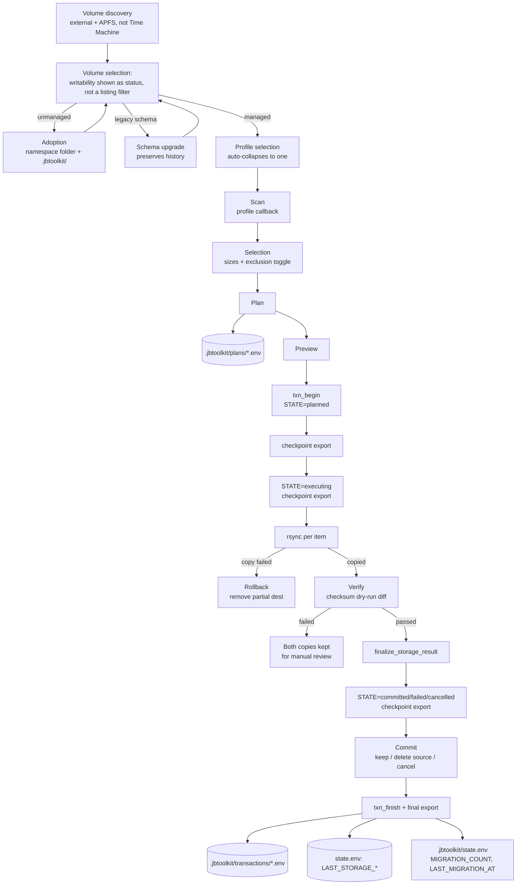

# Storage Architecture

The complete reference for the Storage Platform service (`core/platform/storage/`)
— the first tenant of JB Toolkit's Platform layer. See
[docs/architecture/0002-storage-platform.md](architecture/0002-storage-platform.md)
for *why* it exists; this document is the *how*.

Storage stopped being a migration feature and became reusable infrastructure:
a generic scan→plan→preview→execute→verify→rollback→commit pipeline, an
Adopted Data Volume concept that survives across sessions and machines, and a
public `storage::*` API that is the only surface anything outside this
directory should call. Migration profiles (Home, Downloads, and future ones —
Photos Library, Steam Library, Docker, VMs, Cloud Sync, Backups, Media
Libraries) are lightweight plugins on top; adding one never touches the engine.

## The pipeline



Entry point: `storage::run_profile` in `api.sh` (thin wrapper over
`run_storage_management` in `engine.sh`), called today from
`core/maintenance.sh` between storage analysis and app cleanup. Nothing about
the pipeline is maintenance-specific — a future dedicated module calls the
same function.

## The Adopted Data Volume

An external volume becomes **managed storage** the first time JB Toolkit
initializes it (`initialize_managed_volume` in `volume.sh`):

```
<mount>/.jbtoolkit/
    metadata.env      immutable identity: TOOLKIT_UUID, DISK_UUID,
                       APFS_VOLUME_UUID, ADOPTED_BY, CREATED_AT,
                       CREATED_BY_VERSION, SCHEMA_VERSION, LABEL
    state.env          mutable: MIGRATION_COUNT, LAST_MIGRATION_AT
    plans/             storage_plan_<id>.env
    transactions/      <txn_id>.env, rewritten at each STATE transition
<mount>/JB Toolkit/    standard namespace — every profile writes under here
    Home/              created by the Home profile on first use
    Downloads/         created by the Downloads profile on first use
```

**Plans and transactions live on the volume, not the toolkit's own `logs/`.**
This is a repair shop's toolkit; the same external drive plausibly shuttles
data across many different client Macs over time. A future "was there an
interrupted migration" check needs to find the record by re-plugging the
*volume*, not by trusting whichever Mac's local `logs/` happened to run the
operation.

`metadata.env` fields:

| Key | Purpose |
|---|---|
| `JBTOOLKIT_VOLUME` | `true` — the presence-and-value check `is_adopted_volume` uses |
| `SCHEMA_VERSION` | Forward-compat marker (currently `2`). `check_volume_schema_compat` warns, never blocks, on a schema newer than this toolkit understands |
| `TOOLKIT_UUID` | JB Toolkit's own identity for the volume (`uuidgen`), independent of the filesystem |
| `DISK_UUID` / `APFS_VOLUME_UUID` | The GPT partition UUID and the APFS volume's own UUID (`diskutil info`'s "Disk / Partition UUID" / "Volume UUID"), captured for forensic identity — lets a future check notice if the same mount path now points at a different physical/logical volume |
| `CREATED_BY_VERSION`, `CREATED_AT`, `ADOPTED_BY`, `LABEL` | Birth certificate |

`state.env` fields (`MIGRATION_COUNT`, `LAST_MIGRATION_AT`) are updated by
`touch_volume_usage` after every completed migration — the volume's metadata
is a living record, not a one-time stamp.

**Schema migration, not a breaking upgrade.** A schema-1 volume (the previous
generation: a single flat `.jbtoolkit` *file*, no `DISK_UUID`/`APFS_VOLUME_UUID`)
is recognized as *adopted-but-needs-upgrading*, not unmanaged.
`_upgrade_legacy_volume_metadata` preserves every field that still has a home
(`CREATED_AT`, `ADOPTED_BY`, `MIGRATION_COUNT`, `LAST_MIGRATION_AT`), fetches
the two new UUID fields fresh, writes the current directory structure, then
removes the old file. Runs only when a legacy volume is actually selected for
use — discovery/listing stays read-only.

Every run re-discovers volumes fresh (`discover_storage_volumes`) and
classifies each as managed or generic by reading `.jbtoolkit/` — there is no
separate registry to fall out of sync with reality. Picking an unmanaged
volume offers adoption on the spot; declining returns to the volume list.

**Writability is a status shown per volume, not a discovery filter (v2.2.2).**
A real external volume can be root:wheel-owned with ownership enforcement on
— a normal state for a disk formatted or previously used elsewhere — which
denies a non-root technician's write probe at the volume root. Silently
excluding that volume from the list is indistinguishable from "no external
disk is attached," which was exactly the reported symptom. `STORAGE_VOLUME_CACHE`
carries a `writable` field (`mount|name|free|adopted|writable`) so an
unwritable volume still appears, tagged "⛔ Sin permisos de escritura," with
an actionable message (fix ownership/permissions, or enable "Ignore
ownership" in Disk Utility) if selected — never a silent gap.
`forget_volume` (the inverse) renames `.jbtoolkit` to
`.jbtoolkit.forgotten-<stamp>` instead of deleting it — the volume reports as
unmanaged again, but history is recoverable rather than destroyed by a
moment's misclick, and migrated *data* is never touched.

Reading/writing these files reuses `core/utils.sh`'s `read_kv_value` /
`write_kv_values` — the same flat-file parser `state_value` / `write_state_values`
are built on, generalized once there were two consumers.

## Layer responsibilities

| Layer | File | Responsibility | Explicitly NOT its job |
|---|---|---|---|
| **API** | `api.sh` | The only public surface (`storage::*`). Thin wrappers only — no logic lives here | Anything the wrapped function doesn't already do |
| **Volume** | `volume.sh` | Eligibility (external + APFS, not Time Machine), writability as a per-volume status, adoption, schema migration, discovery, the volume-picker menu, console-user detection | Anything about what gets migrated |
| **Profiles** | `profiles/<id>/` | What to migrate: source root, destination subdir, scan + default exclusions for one kind of data | Volume discovery, copying, verification, disposal — anything past `STORAGE_SCAN_CACHE` |
| **Engine** | `engine.sh` | The profile registry and loader; the generic scan → toggle → preview → execute → verify → rollback → commit pipeline; rsync capability detection; the top-level orchestrator | Knowing what "Home" or "Photos" means |
| **Plan** | `plan.sh` | The frozen contract between selection and execution. Serializes to `.jbtoolkit/plans/*.env` | Deciding what's excluded, executing anything |
| **Transaction** | `transaction.sh` | The execution record, persisted incrementally at each STATE transition. Serializes to `.jbtoolkit/transactions/*.env` | Making decisions, estimating |

## The public API

Nothing outside `core/platform/storage/` should read `metadata.env`/
`state.env` directly, inspect `STORAGE_*` globals, or call a non-`storage::`
function. `api.sh`:

| `storage::*` | Backing | Notes |
|---|---|---|
| `discover_volumes` | `discover_storage_volumes` | refreshes the cache |
| `list_volumes` | reads `STORAGE_VOLUME_CACHE` | data only, doesn't refresh |
| `get_default_volume` | new | first adopted entry, refreshes discovery itself |
| `is_managed` | `is_adopted_volume` | |
| `adopt_volume` | `initialize_managed_volume` | |
| `forget_volume` | `forget_volume` | archives, doesn't delete |
| `health` | new | composite read: managed/healthy/free_space/volume_uuid/pending_transactions/last_transaction/last_verify |
| `free_space` | `storage_volume_free_space` | |
| `verify` | `storage_verify_item` | |
| `rollback` | `storage_rollback_item` | **per-item only** — there is no whole-transaction rollback |
| `transactions` | new | lists `.jbtoolkit/transactions/*.env` as data, not a browser |
| `run_profile` | `run_storage_management` | the only function that changes anything; everything else is a query |

## The profile contract

A profile is a directory under `profiles/` with two files:

```
profiles/<id>/
    profile.env   PROFILE_ID=<id> · PROFILE_LABEL="<display name>" · DEST_SUBDIR=<folder>
    scan.sh       storage_profile_<id>_source_root, storage_profile_<id>_scan
```

`profile.env` is declarative — `DEST_SUBDIR` is always static per profile
(never computed at runtime), so it's a data field, not a "function that
echoes a constant." **Quote any value containing spaces** (`PROFILE_LABEL="Home
del usuario"`) — `profile.env` is sourced as bash, not parsed as flat KV;
an unquoted space starts a second word bash tries to execute as a command.

`load_storage_profiles` (in `engine.sh`, called once by whoever sources the
subsystem) discovers `profiles/*/`, sources each `profile.env`, calls
`register_storage_profile` with the three fields on the profile's behalf,
then sources `scan.sh`. A profile never calls `register_storage_profile`
itself — one less thing a profile author has to remember.

`scan.sh` defines exactly two callbacks:

| Callback | Signature | Job |
|---|---|---|
| `storage_profile_<id>_source_root` | `() → echoes a path` | Where this profile's data lives |
| `storage_profile_<id>_scan` | `(source_root) → fills STORAGE_SCAN_CACHE` | Candidate items as `name\|size_mb\|excluded` lines, `name` relative to `source_root` |

The engine calls these by computed name (`"storage_profile_${id}_scan"` as a
bare command — standard bash, no `eval`) and never inspects a profile's
internals again: selection, planning, mirroring, copying, verification,
rollback, and disposal are 100% generic and identical for every profile.

`profiles/downloads/` exists specifically as proof of this: two small files
(one folder, no exclusion list) get the full pipeline — adoption awareness,
sizing, toggle screen, plan export, verified copy, rollback on failure, gated
deletion — for free, with zero engine changes.

**Rejected on purpose: per-profile `execute.sh`/`verify.sh`.** Copying and
verification have zero profile-specific variance today (100% generic
rsync/checksum), and the engine is explicitly required to stay
domain-agnostic. Per-profile execute/verify hooks would be pure ceremony —
and worse, would let a future profile quietly weaken the uniform
verify-before-offering-deletion guarantee the whole system depends on.

### Worked example: adding a Photos Library profile

```bash
# profiles/photos/profile.env
PROFILE_ID=photos
PROFILE_LABEL="Fototeca"
DEST_SUBDIR="Photos Library"
```
```bash
# profiles/photos/scan.sh
storage_profile_photos_source_root() {
    printf "%s/Pictures\n" "$(resolve_user_home "$(detect_console_user)")"
}

storage_profile_photos_scan() {
    local root="$1" size_mb
    STORAGE_SCAN_CACHE=""
    [[ -d "$root/Photos Library.photoslibrary" ]] || return 0
    size_mb="$(dir_size_mb "$root/Photos Library.photoslibrary")"
    STORAGE_SCAN_CACHE="Photos Library.photoslibrary|${size_mb:-0}|0"$'\n'
}
```
Two files, it appears in the profile picker, gets its own namespace on every
adopted volume, inherits every safety property. The same shape covers Steam
(`~/Library/Application Support/Steam/steamapps`), Docker
(`~/Library/Containers/com.docker.docker/Data`), Virtual Machines (a
hypervisor's VM directory), Cloud Sync / Backups / Media Libraries, or an
arbitrary directory (prompt for a path instead of hardcoding one in
`_source_root`).

## The two contracts

### Storage Plan (selection → execution)

Built by `build_storage_plan <profile_id>`, serialized by `export_storage_plan`
to `.jbtoolkit/plans/storage_plan_<id>.env`. `storage_preview` is pure
presentation over the plan — renders `STORAGE_PLAN_*`, never recomputes
anything. `state.env`'s `LAST_STORAGE_PLAN` stores the **full path** (not a
basename) since the file no longer lives under the toolkit's own `logs/`.

### Storage Transaction (execution → state/history)

Created by `txn_begin`, persisted incrementally by `txn_export` at each real
STATE transition, closed by `txn_finish`. `STORAGE_TXN_UUID` (`uuidgen`) is
the canonical identifier; the filename stays timestamp-based
(`<txn_id>.env`, human-sortable in a directory listing) — dual identifier,
not a replacement.

**`STORAGE_TXN_STATE`: `planned → executing → committed | failed | cancelled`.**
This is deliberately **not** the 7-value
`planned→executing→copied→verified→committed→rolled_back→failed` lifecycle
one might expect. `storage_execute` copies and verifies each item
synchronously, in the same loop iteration — there is no code-observable
moment between "copied" and "verified" to checkpoint, and rollback is a
**per-item** automatic side effect (`STORAGE_TXN_ROLLED_BACK`, a counter),
never a whole-transaction terminal outcome. Writing a STATE value the engine
can't actually produce would be a state-machine version of the false-success
message this project's truthfulness principle exists to prevent. See
[docs/architecture/0004-transactions.md](architecture/0004-transactions.md)
for the full reasoning and the alternative considered (a two-pass execute to
make copied/verified real checkpoints — deferred; rsync's own idempotency
already gives a viable resume story without it).

Checkpoints land at three real points: `txn_begin` (`planned`), immediately
before `storage_execute` runs (`executing` — the actual crash window), and
after `finalize_storage_result` determines the outcome (`committed` for
success/partial, `failed`, or `cancelled`). `txn_export` is idempotent —
always overwrites the same file by ID — so calling it repeatedly is free.
Per-item outcomes (`STORAGE_TXN_VERIFIED`/`FAILED`/`ROLLED_BACK`, plus named
`STORAGE_TXN_VERIFIED_ITEMS`/`FAILED_ITEMS` with reasons) are unchanged from
before and remain the source of truth for what actually happened to each
item — STATE is lifecycle phase, `STORAGE_TXN_RESULT` (unchanged:
`success | partial | failed | cancelled`) is the fine-grained verdict.

`txn_record_summary_in_state` updates the toolkit's local `state.env`
(`LAST_STORAGE_TRANSACTION`, `LAST_STORAGE_MIGRATION`,
`STORAGE_MIGRATION_PROFILE`/`VOLUME`/`MB_COPIED`/`ITEMS_DELETED`) — called
once, by the caller, after the true final export, never at an in-progress
checkpoint (an empty `END`/`RESULT` would otherwise clobber the last real
summary).

**Known, accepted limitation**: `LAST_STORAGE_PLAN`/`LAST_STORAGE_TRANSACTION`
point at paths under whatever `/Volumes/X` the volume happened to mount at
*this session* — stale once unmounted. Acceptable since nothing programmatic
consumes these paths yet; a future Report integration is out of scope here.

## Truthfulness and safety enforcement points

- **Verification is real, not assumed.** `storage_verify_item` runs an
  independent `rsync --checksum --dry-run -i` pass; zero output lines is the
  only thing that counts as "identical." Deliberately `-a -H` only (not the
  copy's fuller `-E`/`-A`/`-X` flags) — on modern macOS, `openrsync` reports a
  false checksum mismatch for byte-identical files when those flags are
  combined with `--checksum --dry-run`. Found by testing, not by inspection.
- **Rollback is scoped to what's actually recoverable.** A copy failure means
  the destination is likely incomplete, so it's removed automatically — the
  source was never touched. A verify failure (copy succeeded, checksum still
  disagrees) is left alone for a human to look at, because automatically
  deleting a copy that merely looks suspicious would destroy the only
  evidence of what went wrong.
- **Source deletion is gated twice**: only items with a `verified` outcome
  are even offered, and disposal requires an explicit second confirmation.
  Deletion re-measures the source size immediately before removing it and
  re-counts what remains afterward, rather than trusting a pre-migration
  scan value or `rm`'s exit code.
- **A schema mismatch warns, never blocks**, in both directions: newer schema
  on disk warns the technician; older schema on disk gets transparently
  upgraded, history preserved.

## Where future functionality belongs

| Future need | Where it goes | Why |
|---|---|---|
| Photos Library / Steam Library / Docker / VMs / Cloud Sync / Backups / Media Libraries | A new `profiles/<id>/` directory (see worked example above) | The engine already generalizes; only the two callbacks differ |
| A profile needing user input (e.g. "which directory?") | The profile's own `_source_root` callback prompts interactively before echoing the path | Callbacks are just functions |
| Storage History browsing | A new file consuming `storage::transactions` | The API already returns the data; only a browser UI is missing |
| A dedicated Storage menu (outside Maintenance) | A new orchestrator sourcing `core/platform/storage/*.sh` and calling `storage::run_profile` | The subsystem has no orchestrator-specific state; it's a shared library like `core/deployment/*` |
| Fine-grained resume (copied/verified as real checkpoints) | A two-pass `storage_execute` (copy-all, then verify-all) | Deliberately deferred — see ADR-0004 |
| Multi-volume awareness (migrate to whichever adopted volume is present) | A lookup by `TOOLKIT_UUID` across `discover_storage_volumes` results | The UUID already exists for exactly this purpose |

## Invariants (violations are design regressions)

1. Nothing outside `core/platform/storage/` calls a non-`storage::` function
   or reads `.jbtoolkit/*.env` directly.
2. The engine never contains a profile-specific string — those live only in
   `profiles/*/`.
3. A profile is exactly two files (`profile.env` + `scan.sh`) plus two
   callbacks. If a profile needs more, that need is generic enough to add to
   every profile's contract, not a one-off special case.
4. Source data is never modified before `commit`, and never deleted without
   a `verified` outcome plus explicit confirmation.
5. A copy failure always rolls back; a verify failure never does.
6. `STORAGE_TXN_STATE` only ever holds a value the engine can actually
   produce — no aspirational states.
7. Every plan and every transaction is exported to the volume; nothing about
   "what would happen" or "what happened" lives only in memory.
8. Adoption is explicit and volume-scoped — no global list of "known disks"
   to fall out of sync with what's actually plugged in.
