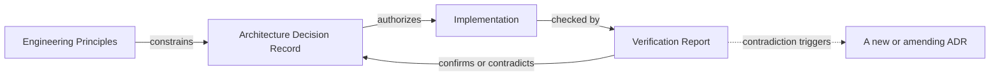

# Architecture Decision Records

Referenced by: [../engineering/README.md](../engineering/README.md) · [../engineering/ENGINEERING_ROLES.md](../engineering/ENGINEERING_ROLES.md) (Engineering Architect) · [../engineering/templates/adr-template.md](../engineering/templates/adr-template.md)

This directory (`docs/architecture/0001-*.md` through the present) is JB
Toolkit's architectural decision log — twelve decisions on record as of
this writing, from the original platform philosophy
([0001](0001-platform-philosophy.md)) through the most recent terminal UI
refinement ([0012](0012-terminal-ui-refinement.md)). This document
explains what an ADR is for in this project, when to write one, and how
the collection as a whole is meant to be read and extended.

## Purpose

An ADR exists to answer one question for a future engineer: **why does the
system look like this, and not some other way that also would have
worked?** Code shows *what* was built. An ADR is the only place that
reliably shows *why*, including the paths that were considered and
deliberately not taken — information that disappears the moment a pull
request merges unless something durable captures it.

JB Toolkit's own history is the case for this: the catalog's preset-picker
screen was removed in [0011](0011-deployment-workflow-simplification.md)
in favor of an in-catalog loader, which was then removed again in
[0012](0012-terminal-ui-refinement.md) after real-world use showed it
wasn't reached for. Without the ADR trail, that reads as indecision. With
it, it reads as exactly what it was: two decisions, each correct given the
evidence available at the time it was made, with the second one openly
citing and superseding the first. **An ADR is not a claim that a decision
is permanent — it's a claim that the decision was made deliberately, on
stated reasoning, that a later ADR can cite and correct in the open.**

## When to create one

Write an ADR when a change does at least one of the following:

- Changes a **module boundary or ownership contract** — who is allowed to
  depend on whom, who owns a piece of shared state, what a layer is
  explicitly *not* allowed to do (see
  [Deployment-Architecture.md](../Deployment-Architecture.md)'s
  "Explicitly NOT its job" column for what this looks like once written
  down).
- Changes or reverses a **previous ADR's decision** — even a partial
  reversal, even one this project's own prior work got right at the time
  and later evidence corrected.
- Introduces or removes a **user-facing workflow**, not just a
  presentation detail within an existing one (removing the preset-picker
  screen warranted an ADR; reformatting the confirmation screen's counts
  did not — see [0012](0012-terminal-ui-refinement.md), which did both in
  the same release and treated them differently).
- Establishes a **new invariant** future code is expected to hold (e.g.
  "the installer never reads the catalog," [0012](0012-terminal-ui-refinement.md)),
  or **relies on** an existing one in a way that would be a regression to
  violate silently.
- Rejects a **substantive alternative** that a reasonable future engineer
  might otherwise re-propose without knowing it was already evaluated.

The Engineering Architect role ([../engineering/ENGINEERING_ROLES.md](../engineering/ENGINEERING_ROLES.md))
is the one authorized to make this call.

## When not to create one

Not every change is architectural, and treating every change as if it
were dilutes the signal an ADR is supposed to carry:

- A bug fix that restores documented behavior needs no ADR — the ADR
  already exists; the fix just makes reality match it again. (It may
  still warrant a Verification Report — see
  [../engineering/VERIFICATION_PROGRAM.md](../engineering/VERIFICATION_PROGRAM.md).)
- A change entirely within one function's implementation, with no change
  to its contract, inputs, outputs, or the invariants other code relies
  on.
- A wording, formatting, or density change to an existing screen that
  doesn't change what the screen does or who can reach it.
- A new catalog entry, preset, or other **data** addition that fits the
  existing schema without changing it.

When in doubt, the cost of a short ADR is much lower than the cost of a
future engineer re-deriving (or re-litigating) a decision that was never
written down. Bias toward writing one.

## How ADRs evolve

An ADR is **never rewritten to match what the system later became.** Once
merged, its Context, Decision, Alternatives, and Consequences sections are
a historical record of what was known and decided at that time — editing
them after the fact to look more correct in hindsight destroys the exact
information the ADR exists to preserve.

When a later decision changes, narrows, or reverses an earlier one:

1. The new decision gets its **own ADR**, at the next sequential number.
   Numbers are never reused and never reordered, regardless of which
   decision a later one supersedes.
2. The new ADR **names the ADR it changes explicitly**, in its Context
   section, and states what evidence justifies the change — see
   [0012](0012-terminal-ui-refinement.md)'s "a deliberate reversal, not a
   walk-back" framing for the standard this is held to.
3. The **earlier ADR gets a short, dated forward-pointer** added at its
   top (not a rewrite of its body) noting it was amended and linking to
   the ADR that did so — see the note at the top of
   [0011](0011-deployment-workflow-simplification.md) pointing to
   [0012](0012-terminal-ui-refinement.md) for the exact form this takes.

This keeps the log append-only and honest: a reader landing on an old ADR
is warned immediately that it's been superseded, without losing what it
originally said or why.

## How ADRs relate to the rest of the governance layer

- **Engineering Principles** ([../engineering/ENGINEERING_PRINCIPLES.md](../engineering/ENGINEERING_PRINCIPLES.md))
  bound what an ADR is allowed to decide. An ADR that would violate a
  principle either doesn't get written as proposed, or is itself the
  vehicle for proposing an amendment to that principle, explicitly.
- **The Engineering Verification Standard** ([../engineering/ENGINEERING_VERIFICATION_STANDARD.md](../engineering/ENGINEERING_VERIFICATION_STANDARD.md))
  governs how a Verification Report checks whether an ADR's decision was
  actually implemented as decided — an ADR states intent; verification is
  the only thing that turns that intent into a checked fact.
- **Implementation** realizes an ADR's decision. Code is never the
  authority on *why* — if the reasoning only exists in a comment, and the
  decision was architectural by the criteria above, the reasoning belongs
  in an ADR instead, where it can be found without reading the
  implementation first.
- **Verification Reports** ([../engineering/VERIFICATION_PROGRAM.md](../engineering/VERIFICATION_PROGRAM.md))
  are what confirms — or contradicts — that an ADR's decision holds in the
  real system. A contradiction is exactly the trigger described in "How
  ADRs evolve" above: it produces a new or amending ADR, not a silent
  edit to the implementation that quietly lets the old ADR go stale.
- **`docs/*.md`** (Catalog-Format.md, Deployment-Architecture.md, and
  siblings) are the **current-state reference** an ADR is not: they
  describe the system as it is today, updated in place as it changes.
  An ADR describes one moment of change and why; a normative doc like
  Catalog-Format.md describes the resulting contract, kept in sync going
  forward. If the two disagree, the normative doc is what's out of date
  (see [Catalog-Format.md](../Catalog-Format.md)'s own framing: "If this
  document and a loader ever disagree, this document wins and the loader
  is the bug" — the same relationship holds between an ADR and the
  document line it produced, in the other direction: the doc must track
  reality, the ADR records the moment reality changed).

## ADRs are historical, never implementation documentation

An engineer who wants to know how the Application Catalog renders today
reads [Deployment-Architecture.md](../Deployment-Architecture.md) or the
code. An engineer who wants to know **why** it renders that way, and what
was tried and rejected first, reads
[0012](0012-terminal-ui-refinement.md). Conflating the two — using an ADR
as the living reference for current behavior — is what makes ADRs go
stale, because "what's current" changes far more often than "why we
decided this in particular." Keep them separate on purpose.
