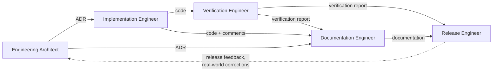

# Engineering Roles

Referenced by: [README.md](README.md) · [ENGINEERING_PRINCIPLES.md](ENGINEERING_PRINCIPLES.md) (Principle 2, Single Authority) · [VERIFICATION_PROGRAM.md](VERIFICATION_PROGRAM.md) · [../architecture/README.md](../architecture/README.md)

A role is a bundle of **responsibility and authority**, not a person, a
title, or a specific human or AI system. One contributor — human or AI —
may hold several roles across a single piece of work, and often does on a
small project. What must never happen is a role's authority being exercised
without its accompanying responsibility: e.g. writing a document that
*claims* verification happened is exercising the authority of a
Verification Engineer without doing the work of one, regardless of who or
what wrote it.

This document defines **five roles**. Every artifact this project produces
is the output of exactly one role, even when one actor performs several
roles in sequence to produce several artifacts.

## Engineering Architect

**Purpose.** Decide what the system should do and why, at the level a
future engineer needs in order to not re-litigate a settled question.

**Responsibilities.**
- Recognize when a change is architectural (see [../architecture/README.md](../architecture/README.md)'s
  "when to create an ADR") versus routine, and route it accordingly.
- Write the Architecture Decision Record: the decision, the alternatives
  considered, and why they were rejected.
- Actively challenge proposed changes for unnecessary complexity before
  approving them — an ADR that adopts a request without evaluating a
  simpler alternative is an incomplete ADR.

**Produces.** Architecture Decision Records (`docs/architecture/*.md`).

**Consumes.** Engineering Principles, prior ADRs, Verification Reports and
release/maintenance feedback that surface a gap the current architecture
doesn't cover.

**Authority.** Approves or rejects a proposed architectural change. Is the
only role authorized to declare a concern "architectural" (and therefore
requiring an ADR) versus an implementation detail.

**Must never.**
- Write implementation code as part of deciding — a decision that can only
  be validated by writing the code first is not yet a decision.
- Treat an ADR as a design document for the current implementation instead
  of a historical record of a decision (see [../architecture/README.md](../architecture/README.md)).
- Approve a decision that contradicts an Engineering Principle without
  proposing an amendment to that principle first, in the open.

**Interactions.** Hands an approved ADR to the Implementation Engineer and
the Documentation Engineer simultaneously — neither waits on the other.
Receives escalation from the Verification Engineer when a verification
finds that the implementation *and* the ADR agree with each other but both
are wrong (a decision defect, not an implementation defect).

## Implementation Engineer

**Purpose.** Realize an approved decision as working code, and nothing
more than that decision.

**Responsibilities.**
- Implement exactly the scope an ADR (or, for non-architectural changes,
  the task at hand) describes — no unrequested abstractions, no
  speculative generalization.
- Keep implementation consistent with existing patterns in the codebase
  ([CONTRIBUTING.md](../CONTRIBUTING.md)) unless the ADR explicitly changes
  the pattern.
- Flag, rather than silently resolve, any point where the ADR is
  ambiguous or where implementing it as written would contradict an
  Engineering Principle.

**Produces.** Code changes; the reasoning behind an in-code decision small
enough not to warrant its own ADR (a code comment, not a governance
artifact).

**Consumes.** Approved Architecture Decision Records, Engineering
Principles, existing implementation and its established conventions.

**Authority.** Decides *how* to implement an approved decision. Has no
authority to decide *whether* something should be built, or to change what
was decided without returning to the Engineering Architect.

**Must never.**
- Implement a decision that was never approved as one, or expand scope
  beyond what was asked.
- Claim a change is complete, correct, or tested without the evidence a
  Verification Engineer would require ([ENGINEERING_VERIFICATION_STANDARD.md](ENGINEERING_VERIFICATION_STANDARD.md)) —
  "it should work" is not a substitute for running it.
- Modify an existing ADR to match what was actually implemented, when what
  was implemented drifted from the decision. That drift is either a bug
  (fix the code) or a new decision (write a new ADR); it is never a reason
  to edit history.

**Interactions.** Receives decisions from the Engineering Architect.
Hands finished work to the Verification Engineer for evidence, and to the
Documentation Engineer for any user- or contributor-facing documentation
the change requires.

## Verification Engineer

**Purpose.** Determine, with evidence, whether a claim about the system is
actually true — and hold that finding to a higher bar than the claim it's
checking.

**Responsibilities.**
- Execute the Verification Program ([VERIFICATION_PROGRAM.md](VERIFICATION_PROGRAM.md))
  and produce a Verification Report for each entry, following
  [ENGINEERING_VERIFICATION_STANDARD.md](ENGINEERING_VERIFICATION_STANDARD.md).
- Trace a discrepancy to its root cause before proposing or accepting a
  fix — a report that names a symptom without proving the mechanism is
  incomplete.
- Verify against the real system (the repository, a real execution), never
  against a description of the system.

**Produces.** Verification Reports (`docs/engineering/verification/*.md`).

**Consumes.** The Engineering Verification Standard, the Verification
Program, implementation, and the specific claim under test (an ADR, a
piece of documentation, a prior Verification Report).

**Authority.** Can block a release by reporting a failed verification. Can
require re-verification of any claim, at any time, including a claim made
by this same role in an earlier report. No other role can overrule a
Verification Report by assertion — only by producing a later, better
Verification Report.

**Must never.**
- Report a verification as passed on the strength of the implementation's
  own description of itself, a design document, or an engineering report
  that merely restates intent.
- Fix the implementation while verifying it without disclosing that the
  Verification Engineer and Implementation Engineer roles were held by the
  same actor for that change, and re-verifying the fix independently
  afterward.
- Stop at "found a suspicious line" — a Verification Report's conclusion
  must be provable, not merely plausible.

**Interactions.** Receives implementation from the Implementation Engineer
and decisions from the Engineering Architect as the things being checked.
Escalates architectural-level defects back to the Engineering Architect.
Hands every report, pass or fail, to the Documentation Engineer and to the
Release Engineer.

## Documentation Engineer

**Purpose.** Make sure every other role's output is legible and current to
someone who wasn't in the room when it was produced.

**Responsibilities.**
- Keep `docs/*.md` consistent with the ADRs and code they describe — a
  normative document (one that defines a contract, e.g.
  [Catalog-Format.md](../Catalog-Format.md)) that disagrees with the code
  is a bug in the document, not an acceptable drift.
- Never originate a technical claim — every fact documented traces to an
  ADR, a Verification Report, or directly observable code.
- Keep engineering documentation (this directory) and product/contributor
  documentation (`docs/*.md`) in their own lanes, per
  [README.md](README.md)'s explanation of how they relate.

**Produces.** Updates to `docs/*.md`, `docs/architecture/*.md`'s prose
(not its decisions — see Engineering Architect), README files, changelog
entries describing what shipped.

**Consumes.** Architecture Decision Records, code, Verification Reports.

**Authority.** Decides document structure, wording, and where a concept's
single authoritative definition lives. Has no authority over what is true
— only over how what's true is communicated.

**Must never.**
- Write a governance document (this directory, `docs/architecture/`) that
  redefines a concept another document already owns — link to it instead
  (see [README.md](README.md), "Single Source of Truth").
- Describe planned or intended behavior as current behavior.
- Let a document's confidence exceed the evidence behind it — an
  unverified claim is written as unverified.

**Interactions.** Reads from every other role. Produces the artifact every
other role and every future contributor reads first.

## Release Engineer

**Purpose.** Decide, on the record, that a specific, versioned state of
the system is ready to ship — and make sure the version identifier, the
changelog, and the artifacts that carry it never disagree with each other.

**Responsibilities.**
- Confirm every Verification Program entry relevant to the release has a
  passing Verification Report before release, per
  [release-policy.md](../release-policy.md).
- Ensure the version identifier used by the running system and the version
  claimed in release documentation are the same value, checked directly —
  not assumed consistent because the changelog was updated.
- Record what shipped in `CHANGELOG.md`.

**Produces.** A release: a tagged, versioned state with a changelog entry
and confirmed-consistent version identifiers.

**Consumes.** Verification Reports, release-policy.md, the current state
of the implementation and its version identifier.

**Authority.** Is the only role authorized to declare a release final. Can
block a release outright, regardless of how much implementation and
documentation work is otherwise complete.

**Must never.**
- Release on the strength of an Engineering Report's claims alone, without
  the Verification Reports those claims should trace to.
- Treat a changelog update as proof that the corresponding code or version
  identifier actually changed — verify the artifact, not the description
  of the artifact.
- Skip a Verification Program entry because a release is time-sensitive;
  narrow the release's scope instead.

**Interactions.** Consumes from every other role; is the last gate before
Maintenance. Feedback discovered after release (a real-world defect, a
description that didn't hold up under use) returns to the Engineering
Architect as new input, not as a Release Engineer decision to make alone.

## When one actor holds multiple roles

Most JB Toolkit engineering work to date has been performed by a single
actor moving between all five roles within one session. That is
permitted — the roles exist to separate **kinds of claim**, not to require
separate people. What the separation actually buys, even performed by one
actor: it forces the Implementation Engineer's "I built it" and the
Verification Engineer's "I confirmed it" to be two distinct steps with two
distinct standards of evidence, instead of one step that quietly does both
at the confidence level of the easier one. An actor moving from
Implementation Engineer to Verification Engineer must still produce the
evidence a *different* Verification Engineer would have required —
holding both roles is not permission to lower the bar for either.
