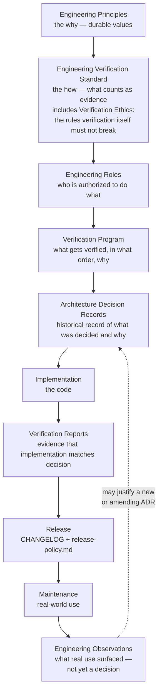

# Engineering Documentation

This directory is the entry point for **how JB Toolkit engineers itself** —
distinct from `docs/*.md`, which document what the toolkit *is*
([Architecture.md](../Architecture.md), [Design-Principles.md](../Design-Principles.md))
and how to work inside it day to day
([CONTRIBUTING.md](../CONTRIBUTING.md)). This directory documents the
**process** that produces and protects that architecture: who decides what,
who verifies what, what evidence a claim needs before it's trusted, and how
a decision becomes a permanent, referenceable record.

Everything under `docs/engineering/` and `docs/architecture/` is itself an
engineering artifact — designed, versioned, and held to the same bar as the
code it governs. Treat a gap or contradiction in these documents as a
process defect, the same way a bug report treats a gap in the software.

## Why a governance layer exists

JB Toolkit's own history is the argument: the catalog, the deployment
pipeline, and the terminal UI each went through multiple iterations where a
later pass corrected an earlier one — not because the earlier work was
careless, but because a claim went unverified until real use (or a direct
inspection of the repository) contradicted it. [architecture/0012-terminal-ui-refinement.md](../architecture/0012-terminal-ui-refinement.md)
is the sharpest example on record: a fix was shipped and described in
detail, and was still wrong, because the description was never checked
against a real terminal session. The fix that actually worked came from
tracing the real execution path and proving the root cause, not from
re-describing the intended design more carefully.

That is the failure mode this layer exists to prevent structurally, not
just by writing better prose next time. A **claim** (an implementation is
correct, a document matches the code, a release is ready) and **evidence**
that the claim holds are different things, produced by different steps, and
this layer keeps them from being silently collapsed into one.

## Philosophy

The eleven Engineering Principles (Principle 0 through Principle 10 —
long-term clarity, Simplicity over Cleverness, Single Authority, Evidence
over Opinion, Stable Contracts, Architecture before Features, Documentation
follows Implementation, Explicit Evolution, Verification is Repeatable,
Tool Independence, Continuous Refinement) are defined once, authoritatively,
in [ENGINEERING_PRINCIPLES.md](ENGINEERING_PRINCIPLES.md), along with the
Engineering Vocabulary and Decision Hierarchy every other document in this
layer relies on. Nothing here restates them; everything here is an
application of them to one concern (roles, verification, decisions,
releases). If a document here ever seems to conflict with a principle, the
principle wins, and the document is the one that's wrong.

## The complete hierarchy

Engineering Principles are **constitutional**, not operational — they are
the one thing this loop does not feed back into. Maintenance never edits a
principle directly; at most, it produces an observation strong enough to
justify a new or amending ADR (see
[../architecture/README.md](../architecture/README.md), "How ADRs
evolve"), which is itself bound by the principles already in force. A
principle changing at all is rare and deliberate — never a side effect of
something observed in the field.

| Layer | Document | Answers |
|---|---|---|
| Engineering Principles | [ENGINEERING_PRINCIPLES.md](ENGINEERING_PRINCIPLES.md) | What do we value, permanently, regardless of what we're building? |
| Engineering Verification Standard | [ENGINEERING_VERIFICATION_STANDARD.md](ENGINEERING_VERIFICATION_STANDARD.md) | What makes a piece of evidence trustworthy? What is verification not allowed to do (Verification Ethics)? |
| Engineering Roles | [ENGINEERING_ROLES.md](ENGINEERING_ROLES.md) | Who is authorized to decide, build, verify, document, and release — and what must each never do? |
| Verification Program | [VERIFICATION_PROGRAM.md](VERIFICATION_PROGRAM.md) | What is the complete, ordered list of things this project verifies over its lifetime? |
| Architecture Decision Records | [../architecture/README.md](../architecture/README.md) + `docs/architecture/*.md` | What was decided, when, why, and what alternatives were rejected? |
| Implementation | the codebase | The decision, realized. |
| Verification Reports | `docs/engineering/verification/*.md` | Does the implementation actually do what the decision said it would? |
| Release | [CHANGELOG.md](../../CHANGELOG.md), [release-policy.md](../release-policy.md) | What shipped, and under what version? |
| Maintenance | real-world use | Does it hold up? |
| Engineering Observations | not a separate document — recorded in whatever ADR or Verification Report follows | What did real-world use surface? Does it justify revisiting a decision — never a principle directly? |

Each layer consumes only the layer(s) above it and produces only what the
next layer needs — see [ENGINEERING_ROLES.md](ENGINEERING_ROLES.md) for the
producer/consumer contract of each artifact, and the "Engineering
Governance System" section there for how responsibility moves between
layers, not just documents.

**Verification Ethics is not a separate document.** It is Appendix A of
the Engineering Verification Standard — ten rules that constrain
verification *itself* rather than defining its mechanics: evidence before
opinion, absence of findings is a valid result (a clean verification is a
successful one, not an incomplete one), observations are not violations,
recommendations never change reality, verify the system that exists (not
the one the reviewer wishes existed), respect documented decisions,
report uncertainty honestly, every claim must be traceable, consistency
over novelty, and protect long-term understanding. See
[ENGINEERING_VERIFICATION_STANDARD.md](ENGINEERING_VERIFICATION_STANDARD.md)
for the full statement of each. It lives inside that document rather than
its own file because splitting it out would let the Standard describe
verification mechanics without also being bound by the ethics of
practicing them — exactly the kind of gap this layer exists to close.

## How the pieces relate to documents that already existed

This layer sits **above** three kinds of documents that predate it and are
untouched by it:

- **[Design-Principles.md](../Design-Principles.md)** documents principles
  of the *product* — what the running software must do (e.g. never report
  an estimate when a measurement is available). **Engineering Principles**
  documents principles of the *process that builds the product*. The two
  are deliberately separate: a product principle can be verified by running
  the software, an engineering principle can only be verified by inspecting
  how a decision was made.
- **[CONTRIBUTING.md](../CONTRIBUTING.md)** is the handbook for working
  inside the existing architecture day to day — where code belongs, style,
  naming, commit conventions. Its existing "Testing expectations" section
  describes verification informally; the Verification Program is that
  same concern formalized into a permanent, ordered, evidence-bearing
  system. CONTRIBUTING.md is not superseded — it is now scoped to
  day-to-day contribution, while this layer owns the standard verification
  is held to.
- **`docs/architecture/*.md`** (ADR-0001 through the present) already
  existed as a working decision log before this governance layer was
  designed. This layer does not change their content or their numbering —
  it documents, for the first time, the discipline that already produced
  them, via [../architecture/README.md](../architecture/README.md).

## Reading paths

- **Making an architectural decision?** Read Engineering Principles, then
  [../architecture/README.md](../architecture/README.md) for when an ADR is
  warranted and how to write one
  ([templates/adr-template.md](templates/adr-template.md)).
- **Verifying a claim about the system?** Read the Engineering Verification
  Standard, find (or propose) the relevant entry in
  [VERIFICATION_PROGRAM.md](VERIFICATION_PROGRAM.md), and use
  [templates/verification-template.md](templates/verification-template.md).
- **Reporting the outcome of engineering work?** Use
  [templates/engineering-report-template.md](templates/engineering-report-template.md).
- **Unsure who is authorized to do what?** [ENGINEERING_ROLES.md](ENGINEERING_ROLES.md)
  is the single source of truth for authority — no other document defines
  or redefines it.

## Single Source of Truth

Every concept in this layer is defined in exactly one place. If you need a
concept and it isn't defined where you'd expect, that is a defect in this
layer — open it as one, don't redefine the concept locally to route around
the gap.
